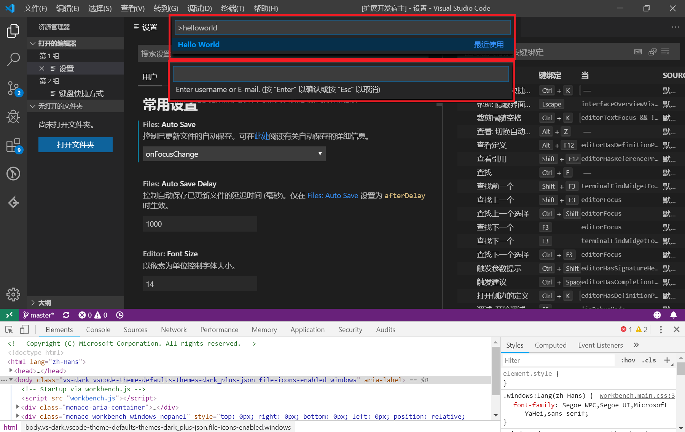
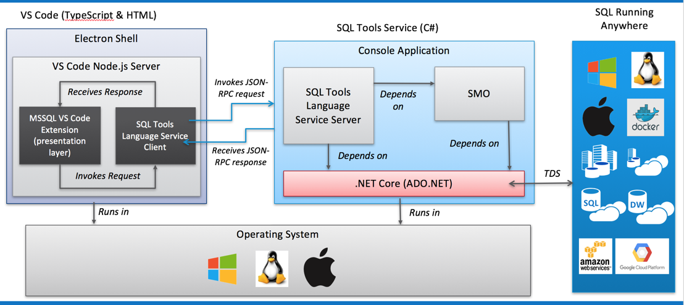

# 插件在 VSCode 中能做什么

- 主题
  - 界面和文本(TextMate 语法)主题色
  - 图标样式
- 通用功能
  - 添加命令
  - 添加配置项
  - 添加快捷键
  - 添加菜单项
  - 添加右键菜单
  - 从文本输入框获取输入(QuickPick)
  - 存储数据(localStorage)
- 工作区扩展
  - 活动栏项目
  - 显示提示框
  - 状态栏信息
  - 显示进度条
  - 打开文件
  - 显示网页(web view)
- 程序语言
  - 实现新语言的高亮
  - 实现新语言的调试器
  - 代码库管理
  - 定义和执行 Task
  - 定义 snippet

## 主题

### 通用功能

## 工作区扩展

因为有 web view 并且底层是 node.js 虽然官方不推荐，但是实际是可以做到非常多的事情。

另外底层的 Electron 是阉割版的，如果需要的功能没有，也可以下载官方的 Electron 替换掉 VSCode 中的版本。

## 程序语言实现

实现编程语言的高亮、悬停提示，导航到定义、自动补全、格式化、调试等功能。

下面是 mssql 的架构和数据流：

https://github.com/Microsoft/vscode-mssql/wiki/architecture

