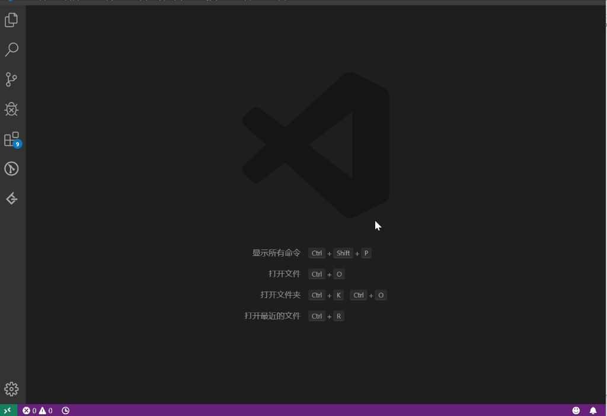
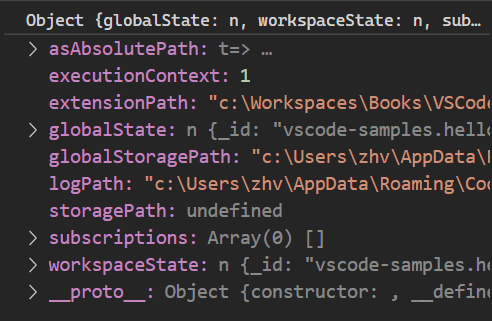

# 编写插件

至少需要 Javascript 或 Typescript 来做入口。

除了入口必须用 JS 或 TS，具体实现完全可以用你熟悉的任何语言，只要在 VSCode 的电脑上可以执行。

例如 Java Language Server 插件的大部分功能都是由 Java 实现的，插件和 Java 代码之间通过 json-RPC 来进行通信。

https://github.com/redhat-developer/vscode-java/wiki/Contribute-a-Java-Extension

# Hello world

https://code.visualstudio.com/api/get-started/your-first-extension

https://github.com/Microsoft/vscode-extension-samples/tree/master/helloworld-sample

这个插件主要功能是运行 `hello world` 命令，弹出消息。



插件编写有三大个部分：

- Activation Event：设置插件激活的时机
- Contribution Point：设置在 VSCode 中哪些地方添加新功能，也就是这个插件增强了哪些功能。
- Register：在 `extension.ts` 中给要写的功能用 `vscode.commands.register...` 给 `Activation Event` 或 `Contribution Point` 中配置的事件绑定方法或者设置监听器。

## packages.json

package 中和插件有关的主要内容是如下几个项目，其中 main 是插件代码的入口文件。

```json
	"activationEvents": [
		"onCommand:extension.helloWorld"
	],
	"main": "./out/extension.js",
	"contributes": {
		"commands": [
			{
				"command": "extension.helloWorld",
				"title": "Hello World"
			},
			{
				"command": "extension.helloVscode",
				"title": "Hello vscode"
			}
		]
	},
```

### activationEvents

https://code.visualstudio.com/api/references/activation-events

原来的 "Hello World" 只是在执行 `extension.helloWorld` 的命令后才会激活插件，所以如果需要在其他情况下激活插件的话，则需要添加对应的命令才行。所以新添加了 `onCommand:extension.helloVscode`。

```json
	"activationEvents": [
    "onCommand:extension.helloWorld",
    "onCommand:extension.helloVscode"
  ],
```

如果忘记添加这个命令则会造成执行命令后，插件并没有启动，命令执行失败。


### Contribution Points

https://code.visualstudio.com/api/references/contribution-points

这个是在 `package.json` 中配置的项目。说明了插件对哪些项目进行了增强。

对于 "hello world" 示例，如果需要在原有功能上添加一个命令 `hello Vscode`，下面的 `command` 为 "extension.helloVscode" 的就是新添加的命令了。

```json
"contributes": {
  "commands": [
    {
      "command": "extension.helloWorld",
      "title": "Hello World"
    },
    {
      "command": "extension.helloVscode",
      "title": "Hello vscode"
    }
  ]
},
```

## Extension.ts

这个文件是插件的入口，一般包括两个函数 `activate` 和 `deactivate`。其中 `activate` 函数是插件激活时也就是在注册的 **Activation Event** 发生的时候就会执行。`deactivate` 中放的是插件关闭时执行的代码。

VSCode 会通过 `Extension Host` 来管理所有插件中这两个函数的生命周期。

```ts
import * as vscode from "vscode";
// 插件激活时的入口
export function activate(context: vscode.ExtensionContext) {
  // 注册 extension.helloWorld 命令
  let disposable = vscode.commands.registerCommand("extension.helloWorld", () => {
    vscode.window.showInformationMessage("Hello World!");
  });

  // 给插件订阅 helloWorld 命令
  context.subscriptions.push(disposable);

  // 新增的代码
  let helloVscode = vscode.commands.registerCommand("extension.helloVscode", () => {
    vscode.window.showInformationMessage("Hello Vscode");
  });
  context.subscriptions.push(helloVscode);

  // return 的内容可以作为这个插件对外的接口
  return {
    hello() {
      return "hello world";
    }
  };
}

// 插件释放的时候触发
export function deactivate() {}
```

### activate

#### ExtensionContext

字面上意思是上下文信息，实际上就是当前插件的状态信息。



#### registerCommand 和 subscriptions.push()

完整的 API 是：`registerCommand(command: string, callback: (args: any[]) => any, thisArg?: any): Disposable`

这个的主要功能是给功能代码(`callback`)注册一个命令(`command`)，然后通过 `subscriptions.push()` 给插件订阅对应的 `command` 事件。

#### return 给其他插件提供接口

如果需要使用其他插件提供的接口，则可以在 `package.json` 中将对应插件添加到 `extensionDependency` 中，然后使用 `getExtension` 函数中的 `export` 属性。

```ts
export function activate(context: vscode.ExtensionContext) {
  let api = {
    hello() {
      return "hello world";
    }
  };
  return api;
}

// 引入其他插件接口
let helloWorld = extensions.getExtension("helloWorld");
let importedApi = helloWorld.exports;

console.log(importedApi.hello());
```

## Debug Extension

在 `launch.json` 中添加一个**扩展开发**的配置，然后按**F5**就可以打开一个新的 VSCode，然后就可以在这个新的 VSCode 中进行插件测试。并且也可以在插件代码的那个 VSCode 中打断点调试。建议在“args”中添加"--disable-extensions"，不然要调试的插件加载太慢，还以为写的有问题。

### Unit Test

https://code.visualstudio.com/api/working-with-extensions/testing-extension

测试插件可以使用 `vscode-test` API 来做测试。需要给它的 `runTests` 提供 `extensionDevelopmentPath, extensionTestsPath` 即开发目录和测试文件目录。测试则使用习惯的单元测试框架即可。

```ts
import * as path from "path";

import { runTests } from "vscode-test";

async function main() {
  try {
    // The folder containing the Extension Manifest package.json
    // Passed to `--extensionDevelopmentPath`
    const extensionDevelopmentPath = path.resolve(__dirname, "../../");

    // The path to the extension test script
    // Passed to --extensionTestsPath
    const extensionTestsPath = path.resolve(__dirname, "./suite/index");

    // Download VS Code, unzip it and run the integration test
    await runTests({ extensionDevelopmentPath, extensionTestsPath });
  } catch (err) {
    console.error("Failed to run tests");
    process.exit(1);
  }
}

main();
```

如果要对测试做**Debug**的话，则可以参考下面内容配置 `launch.json`。其中设置关闭了其他的插件，如果需要打开其他插件，则删掉 **--disable-extensions**。也可以通过给 `runTests` 再添加一个参数 `launchArgs: ['--disable-extensions']` 来关闭其他插件。

```json
{
  "version": "0.2.0",
  "configurations": [
    {
      "name": "Extension Tests",
      "type": "extensionHost",
      "request": "launch",
      "runtimeExecutable": "${execPath}",
      "args": [
        "--disable-extensions",
        "--extensionDevelopmentPath=${workspaceFolder}",
        "--extensionTestsPath=${workspaceFolder}/out/test/suite/index"
      ],
      "outFiles": ["${workspaceFolder}/out/test/**/*.js"]
    }
  ]
}
```

```ts
await runTests({
  extensionDevelopmentPath,
  extensionTestsPath,
  launchArgs: ["--disable-extensions"]
});
```
