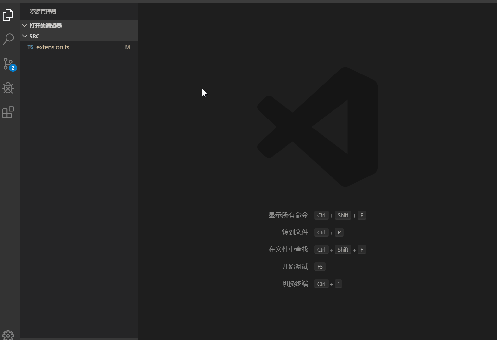
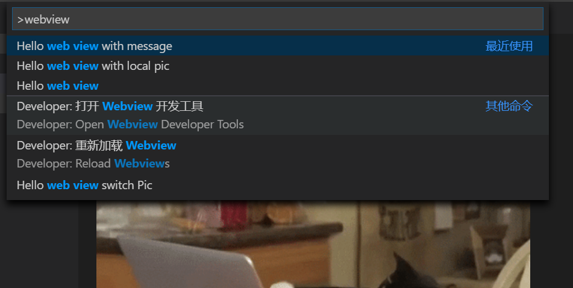
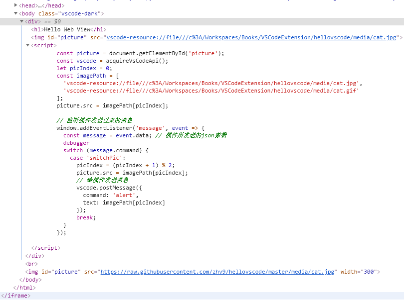

# web view

web view 用好了可以做出非常棒的插件。


## web view 生命周期

生命周期包括三部分：

- 创建：`panel = vscode.window.createWebviewPanel()`
- 显示：`panel.webview.html = htmlString`
- 关闭：`panel.dispose()` 主动关闭，`panel.onDidDispose` 设置关闭时清理的内容。

```ts
export function webViewPanel(context: vscode.ExtensionContext) {
  // 1. 使用 createWebviewPanel 创建一个 panel，然后给 panel 放入 html 即可展示 web view
  const panel = vscode.window.createWebviewPanel(
    'helloWorld',
    'Hello world',
    vscode.ViewColumn.One, // web view 显示位置
    {
      enableScripts: true, // 允许 JavaScript
      retainContextWhenHidden: true // 在 hidden 的时候保持不关闭
    }
  );
  const innerHtml = `<h1>Hello Web View</h1>`;
  panel.webview.html = getWebViewContent(innerHtml);

  // 2. 周期性改变 html 中的内容，因为是直接给 webview.html 赋值，所以是刷新整个内容
  function changeWebView() {
    const newData = Math.ceil(Math.random() * 100);
    panel.webview.html = getWebViewContent(`${innerHtml}<p>${newData}</p>`);
  }
  const interval = setInterval(changeWebView, 1000);

  // 3. 可以通过设置 panel.onDidDispose，让 webView 在关闭时执行一些清理工作。
  panel.onDidDispose(
    () => {
      clearInterval(interval);
    },
    null,
    context.subscriptions
  );
}

function getWebViewContent(body: string, pic?: vscode.Uri) {
  return `<!DOCTYPE html>
<html lang="en">
  <head>
    <meta charset="UTF-8" />
    <meta name="viewport" content="width=device-width, initial-scale=1.0" />
    <meta http-equiv="X-UA-Compatible" content="ie=edge" />
    <title>Document</title>
  </head>
  <body>
    ${body}
    <br />
    
  </body>
</html>
  `;
}
```



## 读取本地文件

一般情况下 web view 是不能直接访问本地文件的，需要使用`vscode-resource`开头的地址。并且只能访问插件所在目录和当前工作区。

在高于 1.38 版 VSCode 下可以使用 `panel.webview.asWebviewUri(onDiskPath)` 生成对应的地址，否则需要使用`onDiskPath.with({ scheme: 'vscode-resource' })`。

```ts
export function webViewLocalContent(context: vscode.ExtensionContext) {
  const panel = vscode.window.createWebviewPanel(
    'HelloWebViewLocalContent',
    'Web View Local Content',
    vscode.ViewColumn.One,
    {
      localResourceRoots: [
        vscode.Uri.file(path.join(context.extensionPath, 'media'))
      ]
    }
  );

  const onDiskPath = vscode.Uri.file(
    path.join(context.extensionPath, 'media', 'cat.jpg')
  );
  // 生成一个特殊的 URI 来给 web view 用。
  // 实际是：vscode-resource: 开头的一个 URI
  // 资源文件只能放到插件安装目录或则用户当前工作区里面
  // 1.38以后才有这个 API，前面版本可以用onDiskPath.with({ scheme: 'vscode-resource' });
  const catPicSrc = panel.webview.asWebviewUri(onDiskPath);
  const body = `<h1>hello local cat</h1>`;
  panel.webview.html = getWebViewContent(body, catPicSrc);
}
```

## web view 和插件通信

向 web view 发信息是通过 `currentPanel.webview.postMessage({})` 发送一个json数据。在 web view 中通过`window.addEventListener('message', callback)`监听`message`信息。

```ts
// 插件发送数据
currentPanel.webview.postMessage({ command: 'hello web view' });

// web 接收
window.addEventListener('message', event => {
  const message = event.data;
  console.log(message.command);
})
```

由于 web view 不能直接调用 vscode 的 API，不过 vscode 还是给它提供了一个 `acquireVsCodeApi()` 的函数，它返回的对象中有一个 postMessage 方法。web view 可以通过这个方法给 vscode 发送消息。插件端则通过`currentPanel.webview.onDidReceiveMessage()`订阅接收消息的事件。

```ts
// web view 向插件端发送数据
const vscode = acquireVsCodeApi();
vscode.postMessage({
  command: 'alert',
  text: 'hello vscode'
});

// 插件端接收数据
currentPanel.webview.onDidReceiveMessage(
    message => {
      switch (message.command) {
        case 'alert':
          vscode.window.showInformationMessage(message.text);
          return;
      }
    },
    undefined,
    context.subscriptions
  );
```



## 调试 web view

可以使用下面 web view develop tool 命令。


打开后可以看到 web view 包在一个 iframe 中，断点什么的都是支持的，内容如下：


