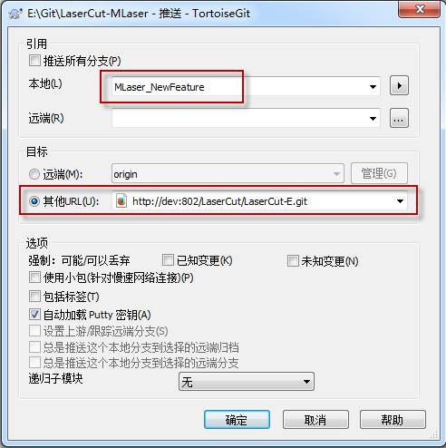
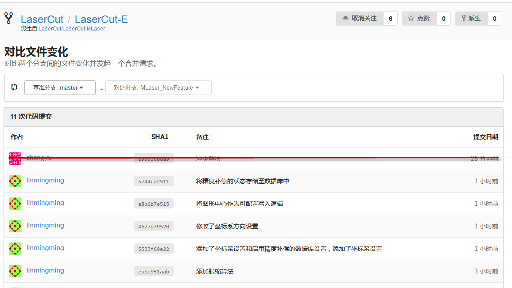
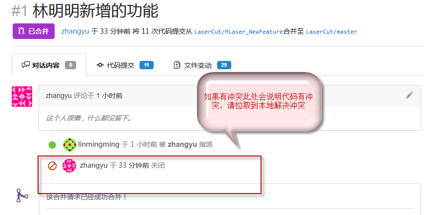
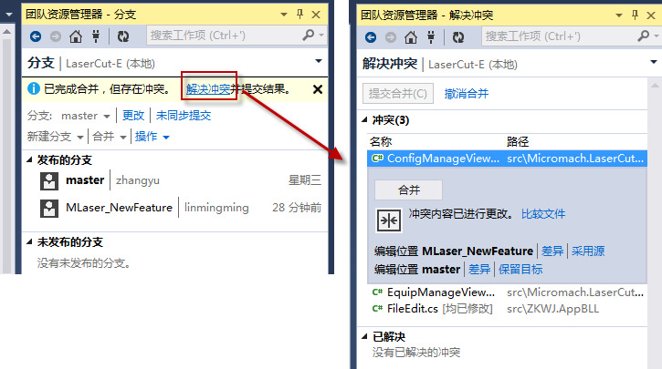
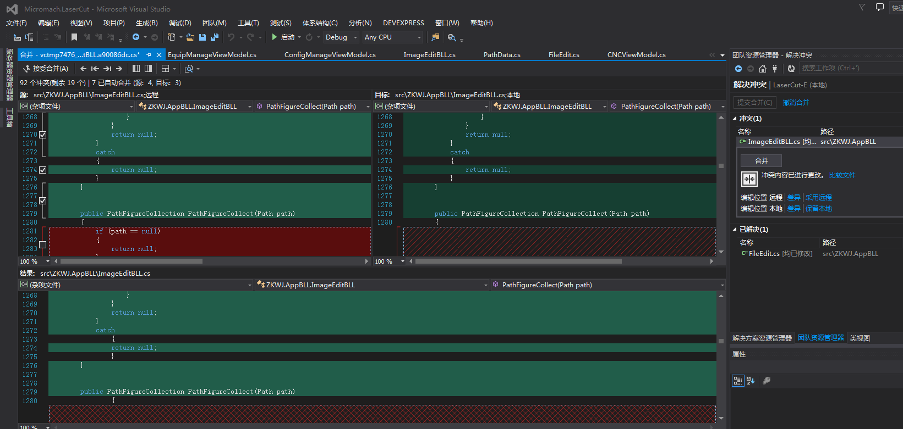
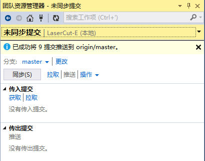
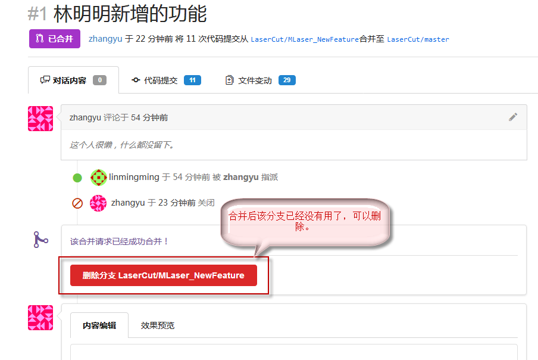

## 修改内容创建分支
> 

2. 修改完成后推送分支到目标项目代码库 
> 

##  在目标库上创建合并请求
> 

##  对比文件并正式创建合并请求
> 

##  产生冲突和解决方法
> 

##  目标项目从远程拉取将要合并的分支
> 

##  切换到master分支并将新分支合并过来
> 

## 选择冲突解决
> 

## 冲突修改
> 

## 推送已解决的代码到远端
> 

## 解决冲突后的合并请求
> 

## 合并分支后的提交图
> 