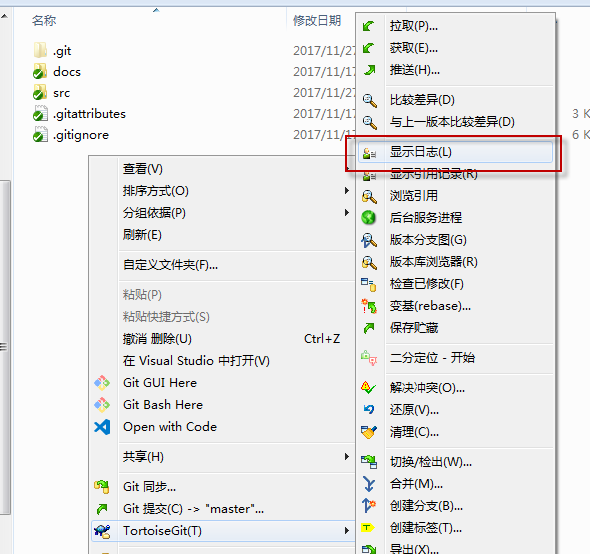
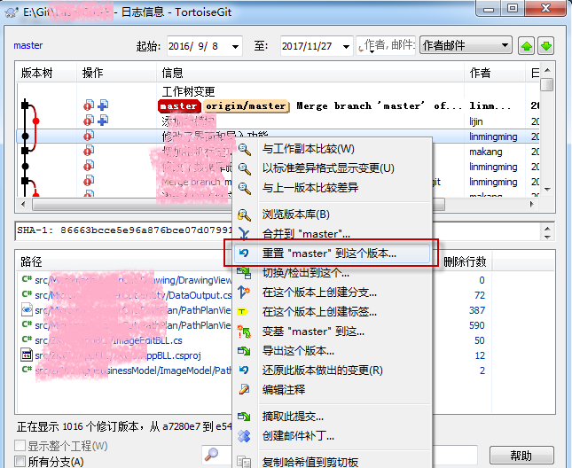
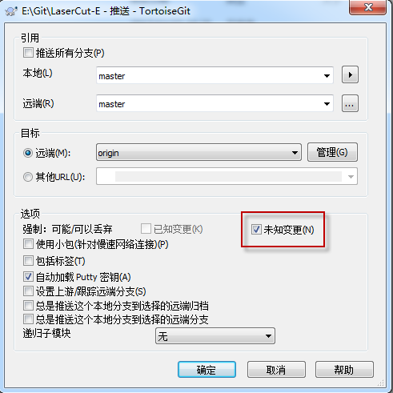

## 查看日志

## 退回到某个版本
根据需要选择某个版本，点右键选择“重置master(如果是master分支的话)到这个版本”
命令: git reset

## 选择回退方式
命令:git reset -(soft、mixed、hard) commit_id

## 如果这个提交已经推送到服务器，则进行一次推送，修正服务器中的库
推送时记得选择“未知版本”选项，代表git push --force

