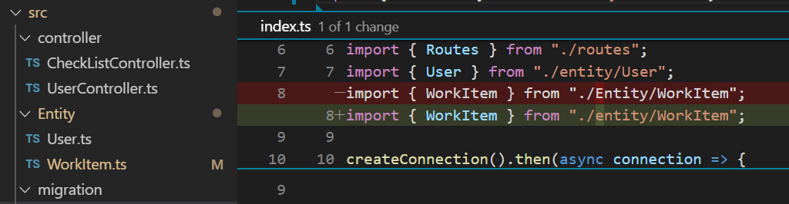

# Install typescript

```sh
npm install -g typescript
npm install -g ts-node
```

# command line

```sh
yarn add --dev ts-node tslint typescript
yarn add commander colors axios @types/node
```

# express with sqlite

## 脚本

```sh
yarn add --dev ts-node typescript @types/node tslint
yarn add sqlite reflect-metadata body-parser express typeorm

# init sqlite with express example
# https://github.com/typeorm/typeorm
typeorm init --name MyProject --database <mysql|sqlite> --express
```
## typeorm 问题
typeorm 有个问题，目录大小写会影响 entity 获取，下图将大写的 Entity 改成小写的 entity，create 时就不会再报错了。


## 调试

如果需要用 vscode 调试 ts 程序或者其他 node 的高级参数，则需要使用 `node -r ts-node/register` 然后添加 `--inspect` 这一类参数即可。


# react

```sh
# https://create-react-app.dev/docs/adding-typescript
yarn create react-app <my-app> --typescript

yarn add react-router @types/react-router history @types/history

yarn add redux react-redux @types/react-redux react-router-redux@next @types/react-router-redux

```
