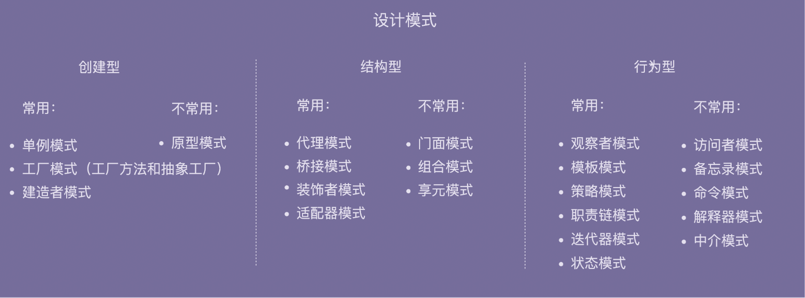

# Design Principle And Pattern

---

# 面向对象

---

## 四大特性

- 封装
    - 是什么：**访问权控制**。主要就是对访问权做限制，外界不需要知道的就不暴露方法。隐藏了信息，保护了数据。
    - 解决了：**不可控问题和增强易用性**。如果不做限制，那任何代码都可以修改类中的属性，这样就不可控了。影响代码的可读性和可维护性。暴露的操作少了，也使类更易用。
    - 实现：java 中的 public、private 等关键字。Go 中的首字母大小写。
    - 设计原则：迪米特法则（最小知识）
- 抽象
    - 抽象可以算作面向对象的特性也可以不算，因为它太过通用了。
    - 是什么：**隐藏方法具体实现**。对于开发者，不需要知道实现细节，只需要通过方法名、出入参数和注释就可以知道类或方法的作用。并且就算没有接口定义，单单一个类本身，除去实现部分不去研究的话，它也是一个抽象。
    - 解决了：**过滤不必要的信息**。设计时不要有过多的实现细节。方法命名时不能命名为 `getAliyunPictureUrl()` 而是 `getPictureUrl()`
    - 实现：java 中的 interface、abstract 和函数定义。Go 中的各个函数定义也算是抽象。
    - 设计原则：基于接口而非实现编程、开闭原则、代码解耦。
- 继承
    - 组合优于继承，甚至很多人认为继承是反模式，能不用就不用。
    - 是什么：**表示 is-a 的关系**。子类继承父类的字段和方法，这样子类就可以复用父类的方法而不用再重写一遍了。
    - 解决了：**代码复用的问题**。如果两个类有相同的属性和方法，就可以将这些**相同的内容抽取到父类中**，让两个子类继承父类。但过度使用会导致代码可读性和可维护性变差。
    - 实现：java 中的 extends。Go 没有继承，通过组合来实现代码复用。
- 多态
    - 是什么：**子类可以替换父类，函数可接受相同签名的参数**。在实际的代码运行过程中，调用子类的方法实现。另外两种是利用接口类语法或鸭子类型。
    - 解决了：**可扩展性和复用性**。使用一个函数就可以实现不同类型的相同目的的功能（例如用一个 print() 打印 Array 或 LinkedList，print 代码是不用改动的，只需要实现相关的方法）。
    - 实现：1. java 中的 @Override。即子类继承父类后重写父类方法。使用的时候用子类实例化。2. 定义接口，然后对其实现。3. Java 没有鸭子类型，一般动态语言才有，但 Go 语言是可以的，只要签名相同（都有同样的函数定义），Go 语言就会认为是同样的类型。
    - 设计原则：Liskov替换原则。

实际面向对象没有一个统一的定义，从最简单的理解来看：将对象或类作为代码组织的基本单元，来进行编程的一种编程范式或者编程风格，并不一定需要封装、抽象、继承、多态这四大特性的支持。

---

## 使用组合而不是继承

比如对于鸟 `AbstractBird` 这种类型，父类定义了 fly() 子类继承。但有些鸟不能飞，是不是要再定义两个子类，可以飞的和不可以飞的，然后两类鸟分别继承这两个子类。但有些鸟可以叫有些不行，那又得在前两种上再分别加上两个是否可以叫的子类。如果再有其他的那子类就太多了，变得非常复杂。

继承的最大问题在于，继承层次过深、继承关系过于复杂会影响到代码的可读性和可维护性。

## 使用接口

使用组合、接口、委托可以解决继承的问题。首先要定义接口。接口表示具有某种行为特性。

```java

public interface Flyable {
  void fly();
}
public interface Tweetable {
  void tweet();
}
public interface EggLayable {
  void layEgg();
}
public class Ostrich implements Tweetable, EggLayable {//鸵鸟
  //... 省略其他属性和方法...
  @Override
  public void tweet() { //... }
  @Override
  public void layEgg() { //... }
}
public class Sparrow impelents Flyable, Tweetable, EggLayable {//麻雀
  //... 省略其他属性和方法...
  @Override
  public void fly() { //... }
  @Override
  public void tweet() { //... }
  @Override
  public void layEgg() { //... }
}
```

但只是用接口的话，每个会下蛋的鸟都要实现一遍 layEgg() 方法，并且实现逻辑是一样的，这就会导致代码重复的问题。这时就到**组合**和**委托**部分了。

---

## 组合和委托

针对三个接口再定义三个实现类：

- FlyAbility：实现 fly() 方法
- TweetAbility：实现 tweet() 方法
- EggLayAbility：实现 layEgg() 方法

```java
public interface Flyable {
  void fly()；
}
public class FlyAbility implements Flyable {
  @Override
  public void fly() { //... }
}
//省略Tweetable/TweetAbility/EggLayable/EggLayAbility

public class Ostrich implements Tweetable, EggLayable {//鸵鸟
  private TweetAbility tweetAbility = new TweetAbility(); //组合
  private EggLayAbility eggLayAbility = new EggLayAbility(); //组合
  //... 省略其他属性和方法...
  @Override
  public void tweet() {
    tweetAbility.tweet(); // 委托
  }
  @Override
  public void layEgg() {
    eggLayAbility.layEgg(); // 委托
  }
}
```

---

# SOLID 原则

- SOLID 之间的关系
    - https://insights.thoughtworks.cn/what-is-solid-principle/
- SRP: 单一职责
    - 并不是一个类只做一件事，而应该**关注变化**。最初的定义是一个模块应该有且仅有一个变化的原因，后来其定义升级为一个模块应该对一类且仅对一类行为者负责。
    - 应用单一职责原则衡量模块，**分离关注点，粒度越小越好**。
- OCP: 开闭原则
    - 对扩展开放对修改封闭。需要预留扩展点，每一个扩展点都是一个需要设计的模型。
    - **分离关注点，找到共性**。
- LSP: 里氏替换
    - 类型替换。子类可以替换基类，而不会出错。避免子类和基类行为不一致。
    - **用父类的角度去思考，设计行为一致的子类。**
- ISP: 接口分离
    - 接口要小，要用组合的形式把它们组合起来使用。避免赖了不需要的接口。其实也就是单一职责。
    - **识别对象的不同角色，设计小接口。**
- DIP: 依赖倒置
    - 高层次模块不应该依赖低层次模块，应该依赖于抽象。抽象不应依赖于细节，细节应依赖于抽象。
    - **依赖于构建出来的抽象，而不是具体类。**
    - 比如有一个 button 执行了开关灯的操作，如果有日光灯和白炽灯，不应该依赖两种灯中的开关操作。而是定义一个通用开关接口，让两种灯都实现这个接口。无论给 button 哪种灯，只要执行接口对应的操作就行。

---

# 设计模式

用数学来比喻的话，**设计原则就像公理**，它们是我们讨论各种问题的基础，**而设计模式则是定理**，它们是在特定场景下，对于经常发生的问题给出的一个可复用的解决方案。

设计模式背后其实是各种设计原则，我们在实际的工作中，更应该按照设计原则去写代码，不一定要强求设计模式，而按照设计原则去写代码的结果，往往是变成了某个模式。

## 分类

- 创建型
    - 常用：单例模式、工厂模式（工厂方法和抽象工厂）、建造者模式
    - 不常用：原型模式
    - 创建型模式主要解决对象的创建问题，封装复杂的创建过程，解耦对象的创建代码和使用代码。
    - 单例模式用来创建全局唯一的对象。工厂模式用来创建不同但是相关类型的对象（继承同一父类或者接口的一组子类），由给定的参数来决定创建哪种类型的对象。建造者模式是用来创建复杂对象，可以通过设置不同的可选参数，“定制化”地创建不同的对象。原型模式针对创建成本比较大的对象，利用对已有对象进行复制的方式进行创建，以达到节省创建时间的目的。
- 结构型
    - 常用：代理模式、桥接模式、装饰者模式、适配器模式
    - 不常用：门面模式、组合模式、享元模式
    - 结构型模式主要总结了一些类或对象组合在一起的经典结构，这些经典的结构可以解决特定应用场景的问题。
- 行为型
    - 常用：观察者、模板、策略、职责链、迭代器、状态
    - 不常用：访问者、备忘录、命令、解释器、中介



---

## 创建型

创建型模式主要解决对象的创建问题，封装复杂的创建过程，解耦对象的创建代码和使用代码。

---

### 单例模式

**目的**：是用单例模式主要是为了处理资源访问的冲突，创建全局唯一的对象。

一个类只允许创建一个对象（或者叫实例），那这个类就是一个单例类，这种设计模式就叫作单例设计模式。

单例模式有几种实现方式

- 静态加载
    - 在类加载的时候，instance 静态实例就已经创建并初始化好了，所以，instance 实例的创建过程是线程安全的。
    - 使用静态变量直接初始化
- 延迟加载
    - 相对于静态加载，这种可以在需要的时候再加载。但基于 fail-fast 尽量提前加载好会比较好，因为在运行时延迟加载的时候 OOM 就不好了。
    - 在 get 函数中初始化。可以用线程锁（双重检测），也可以用静态内部类来实现。

单例也有它的问题，比如

- 单例对 OOP 特性的支持不友好
- 单例会隐藏类之间的依赖关系
- 单例对代码的扩展性不友好
- 单例对代码的可测试性不友好
- 单例不支持有参数的构造函数

---

#### 静态加载

```java
public class IdGenerator { 
  private AtomicLong id = new AtomicLong(0);
  private static final IdGenerator instance = new IdGenerator();
  private IdGenerator() {}
  public static IdGenerator getInstance() {
    return instance;
  }
  public long getId() { 
    return id.incrementAndGet();
  }
}
```

---

#### 延迟加载

```java
public class IdGenerator { 
  private AtomicLong id = new AtomicLong(0);
  private static IdGenerator instance;
  private IdGenerator() {}
  public static IdGenerator getInstance() {
    if (instance == null) {
      synchronized(IdGenerator.class) { // 此处为类级别的锁
        if (instance == null) {
          instance = new IdGenerator();
        }
      }
    }
    return instance;
  }
  public long getId() { 
    return id.incrementAndGet();
  }
}
```

```java
public class IdGenerator { 
  private AtomicLong id = new AtomicLong(0);
  private IdGenerator() {}

  private static class SingletonHolder{
    private static final IdGenerator instance = new IdGenerator();
  }
  
  // 只有在调用 getInstance 的时候内部类才会初始化
  public static IdGenerator getInstance() {
    return SingletonHolder.instance;
  }
 
  public long getId() { 
    return id.incrementAndGet();
  }
}
```

---

### 工厂模式

**目的**：当创建对象是一个“大工程”的时候，我们一般会选择使用工厂模式，来封装对象复杂的创建过程。工厂模式一般包含下面几种

- 简单工厂
- 工厂方法
- 抽象工厂

#### 简单工厂

通过 if 或者 hash table 来给实例。这个的问题就在于不符合开闭原则，每次要添加新实现都要改这个工厂的代码，不过不频繁的话问题不大。

```java
public class RuleConfigParserFactory {
  private static final Map<String, RuleConfigParser> cachedParsers = new HashMap<>();

  static {
    cachedParsers.put("json", new JsonRuleConfigParser());
    cachedParsers.put("xml", new XmlRuleConfigParser());
    cachedParsers.put("yaml", new YamlRuleConfigParser());
    cachedParsers.put("properties", new PropertiesRuleConfigParser());
  }

  public static IRuleConfigParser createParser(String configFormat) {
    if (configFormat == null || configFormat.isEmpty()) {
      return null;//返回null还是IllegalArgumentException全凭你自己说了算
    }
    IRuleConfigParser parser = cachedParsers.get(configFormat.toLowerCase());
    return parser;
  }
}
```

---

#### 工厂方法

工厂方法就是通过多态来实现工厂，而不是 if 分支判断。但这个在使用的时候还是又问题，还是需要一个简单工厂来处理使用哪个工厂。

```java
public interface IRuleConfigParserFactory {
  IRuleConfigParser createParser();
}

public class JsonRuleConfigParserFactory implements IRuleConfigParserFactory {
  @Override
  public IRuleConfigParser createParser() {
    return new JsonRuleConfigParser();
  }
}

public class XmlRuleConfigParserFactory implements IRuleConfigParserFactory {
  @Override
  public IRuleConfigParser createParser() {
    return new XmlRuleConfigParser();
  }
}

//....
```

---

#### 抽象工厂

如果在比较特殊的情况下，如分类比较多的时候，可以使用抽象工厂，以后如果要添加只要在这一个工厂类里加就行了，不用创建过多工厂类。抽象工厂一般用的比较少。

```java
public interface IConfigParserFactory {
  IRuleConfigParser createRuleParser();
  ISystemConfigParser createSystemParser();
  //此处可以扩展新的parser类型，比如IBizConfigParser
}

public class JsonConfigParserFactory implements IConfigParserFactory {
  @Override
  public IRuleConfigParser createRuleParser() {
    return new JsonRuleConfigParser();
  }

  @Override
  public ISystemConfigParser createSystemParser() {
    return new JsonSystemConfigParser();
  }
}

public class XmlConfigParserFactory implements IConfigParserFactory {
  @Override
  public IRuleConfigParser createRuleParser() {
    return new XmlRuleConfigParser();
  }

  @Override
  public ISystemConfigParser createSystemParser() {
    return new XmlSystemConfigParser();
  }
}

// 省略YamlConfigParserFactory和PropertiesConfigParserFactory代码
```

---

### 建造者模式

**目的**：在初始化实例的时候参数列表非常长，或者有参数检查的情况下，就需要建造者了。

工厂模式是用来创建不同但是相关类型的对象（继承同一父类或者接口的一组子类），由给定的参数来决定创建哪种类型的对象。建造者模式是用来创建一种类型的复杂对象，通过设置不同的可选参数，“定制化”地创建不同的对象。

我们可以把校验逻辑放置到 Builder 类中，先创建建造者，并且通过 set() 方法设置建造者的变量值，然后在使用 build() 方法真正创建对象之前，做集中的校验，校验通过之后才会创建对象。

```java
public class ResourcePoolConfig {
  private String name;
  private int maxTotal;
  private int maxIdle;
  private int minIdle;

  private ResourcePoolConfig(Builder builder) {
    this.name = builder.name;
    this.maxTotal = builder.maxTotal;
    this.maxIdle = builder.maxIdle;
    this.minIdle = builder.minIdle;
  }
  //...省略getter方法...

  //我们将Builder类设计成了ResourcePoolConfig的内部类。
  //我们也可以将Builder类设计成独立的非内部类ResourcePoolConfigBuilder。
  public static class Builder {
    private static final int DEFAULT_MAX_TOTAL = 8;
    private static final int DEFAULT_MAX_IDLE = 8;
    private static final int DEFAULT_MIN_IDLE = 0;

    private String name;
    private int maxTotal = DEFAULT_MAX_TOTAL;
    private int maxIdle = DEFAULT_MAX_IDLE;
    private int minIdle = DEFAULT_MIN_IDLE;

    public ResourcePoolConfig build() {
      // 校验逻辑放到这里来做，包括必填项校验、依赖关系校验、约束条件校验等
      if (StringUtils.isBlank(name)) {
        throw new IllegalArgumentException("...");
      }
      if (maxIdle > maxTotal) {
        throw new IllegalArgumentException("...");
      }
      if (minIdle > maxTotal || minIdle > maxIdle) {
        throw new IllegalArgumentException("...");
      }

      return new ResourcePoolConfig(this);
    }

    public Builder setName(String name) {
      if (StringUtils.isBlank(name)) {
        throw new IllegalArgumentException("...");
      }
      this.name = name;
      return this;
    }

    public Builder setMaxTotal(int maxTotal) {
      if (maxTotal <= 0) {
        throw new IllegalArgumentException("...");
      }
      this.maxTotal = maxTotal;
      return this;
    }

    public Builder setMaxIdle(int maxIdle) {
      if (maxIdle < 0) {
        throw new IllegalArgumentException("...");
      }
      this.maxIdle = maxIdle;
      return this;
    }

    public Builder setMinIdle(int minIdle) {
      if (minIdle < 0) {
        throw new IllegalArgumentException("...");
      }
      this.minIdle = minIdle;
      return this;
    }
  }
}

// 这段代码会抛出IllegalArgumentException，因为minIdle>maxIdle
ResourcePoolConfig config = new ResourcePoolConfig.Builder()
        .setName("dbconnectionpool")
        .setMaxTotal(16)
        .setMaxIdle(10)
        .setMinIdle(12)
        .build();
```

---

## 结构型

---

### 代理模式

目的：它在不改变原始类（或叫被代理类）代码的情况下，通过引入代理类来给原始类附加功能。

有点像函数式编程的高阶函数，或者直接将原函数通过参数注入到代理函数中。

#### 应用场景

1. 业务系统的非功能性需求，如：监控、统计、鉴权、限流、事务、幂等、日志
2. 在 RPC、缓存等应用场景中

---

#### 需要加入代理模式的代码

```java
public class UserController {
  //...省略其他属性和方法...
  private MetricsCollector metricsCollector; // 依赖注入

  public UserVo login(String telephone, String password) {
    long startTimestamp = System.currentTimeMillis();

    // ... 省略login逻辑...

    long endTimeStamp = System.currentTimeMillis();
    long responseTime = endTimeStamp - startTimestamp;
    RequestInfo requestInfo = new RequestInfo("login", responseTime, startTimestamp);
    metricsCollector.recordRequest(requestInfo);

    //...返回UserVo数据...
  }

  public UserVo register(String telephone, String password) {
    long startTimestamp = System.currentTimeMillis();

    // ... 省略register逻辑...

    long endTimeStamp = System.currentTimeMillis();
    long responseTime = endTimeStamp - startTimestamp;
    RequestInfo requestInfo = new RequestInfo("register", responseTime, startTimestamp);
    metricsCollector.recordRequest(requestInfo);

    //...返回UserVo数据...
  }
}
```

问题：第一，性能计数器框架代码侵入到业务代码中，跟业务代码高度耦合。如果未来需要替换这个框架，那替换的成本会比较大。第二，收集接口请求的代码跟业务代码无关，本就不应该放到一个类中。业务类最好职责更加单一，只聚焦业务处理。

---

#### 加入代理模式的代码

```java
public interface IUserController {
  UserVo login(String telephone, String password);
  UserVo register(String telephone, String password);
}

public class UserController implements IUserController {
  //...省略其他属性和方法...

  @Override
  public UserVo login(String telephone, String password) {
    //...省略login逻辑...
    //...返回UserVo数据...
  }

  @Override
  public UserVo register(String telephone, String password) {
    //...省略register逻辑...
    //...返回UserVo数据...
  }
}

public class UserControllerProxy implements IUserController {
  private MetricsCollector metricsCollector;
  private UserController userController;

  public UserControllerProxy(UserController userController) {
    this.userController = userController;
    this.metricsCollector = new MetricsCollector();
  }

  @Override
  public UserVo login(String telephone, String password) {
    long startTimestamp = System.currentTimeMillis();

    // 委托
    UserVo userVo = userController.login(telephone, password);

    long endTimeStamp = System.currentTimeMillis();
    long responseTime = endTimeStamp - startTimestamp;
    RequestInfo requestInfo = new RequestInfo("login", responseTime, startTimestamp);
    metricsCollector.recordRequest(requestInfo);

    return userVo;
  }

  @Override
  public UserVo register(String telephone, String password) {
    long startTimestamp = System.currentTimeMillis();

    UserVo userVo = userController.register(telephone, password);

    long endTimeStamp = System.currentTimeMillis();
    long responseTime = endTimeStamp - startTimestamp;
    RequestInfo requestInfo = new RequestInfo("register", responseTime, startTimestamp);
    metricsCollector.recordRequest(requestInfo);

    return userVo;
  }
}

//UserControllerProxy使用举例
//因为原始类和代理类实现相同的接口，是基于接口而非实现编程
//将UserController类对象替换为UserControllerProxy类对象，不需要改动太多代码
IUserController userController = new UserControllerProxy(new UserController());
```

如果没办法修改原始类的话，还可以通过继承来实现。和上面代码差别的部分就是 `userController` 换成 `super`。

---

### 桥接模式

目的：将抽象和实现解耦，让它们可以独立变化。

有点像依赖接口而不是实现编程的原则。

JDBC 就是使用了桥接模式，也就是下面的源码。

```java
Class.forName("com.mysql.jdbc.Driver");//加载及注册JDBC驱动程序
String url = "jdbc:mysql://localhost:3306/sample_db?user=root&password=your_password";
Connection con = DriverManager.getConnection(url);
Statement stmt = con.createStatement()；
String query = "select * from test";
ResultSet rs=stmt.executeQuery(query);
while(rs.next()) {
  rs.getString(1);
  rs.getInt(2);
}
```

---

当执行 Class.forName(“com.mysql.jdbc.Driver”) 这条语句的时候，实际上是做了两件事情。第一件事情是要求 JVM 查找并加载指定的 Driver 类，第二件事情是执行该类的静态代码，也就是将 MySQL Driver 注册到 DriverManager 类中。

```java
package com.mysql.jdbc;
import java.sql.SQLException;

public class Driver extends NonRegisteringDriver implements java.sql.Driver {
  static {
    try {
      java.sql.DriverManager.registerDriver(new Driver());
    } catch (SQLException E) {
      throw new RuntimeException("Can't register driver!");
    }
  }

  /**
   * Construct a new driver and register it with DriverManager
   * @throws SQLException if a database error occurs.
   */
  public Driver() throws SQLException {
    // Required for Class.forName().newInstance()
  }
}
```

---

当我们把具体的 Driver 实现类（比如，com.mysql.jdbc.Driver）注册到 DriverManager 之后，后续所有对 JDBC 接口的调用，都会委派到对具体的 Driver 实现类来执行。而 Driver 实现类都实现了相同的接口（java.sql.Driver ），这也是可以灵活切换 Driver 的原因。

```java
public class DriverManager {
  private final static CopyOnWriteArrayList<DriverInfo> registeredDrivers = new CopyOnWriteArrayList<DriverInfo>();

  //...
  static {
    loadInitialDrivers();
    println("JDBC DriverManager initialized");
  }
  //...

  public static synchronized void registerDriver(java.sql.Driver driver) throws SQLException {
    if (driver != null) {
      registeredDrivers.addIfAbsent(new DriverInfo(driver));
    } else {
      throw new NullPointerException();
    }
  }

  public static Connection getConnection(String url, String user, String password) throws SQLException {
    java.util.Properties info = new java.util.Properties();
    if (user != null) {
      info.put("user", user);
    }
    if (password != null) {
      info.put("password", password);
    }
    return (getConnection(url, info, Reflection.getCallerClass()));
  }
  //...
}
```

---

### 装饰器模式

---

### 适配器模式

---

## 行为型
