# 函数式编程

基于《Javascript 函数式编程指南》

---

## 函数式思想

在设计时，先问下自己，是否遵从了以下设计原则：

- 可扩展性 - 是否需要不断重构来支持额外功能
- 易模块化 - 改了一个文件，另一个文件会不会受到影响
- 可测试性 - 添加单元测试是否麻烦
- 易推理性 - 代码是否非结构化严重并且难以推理

如果有这些问题，那函数式编程就很适合了。

函数式编程不是新工具而是一种编程范式。

---

## 什么是函数式编程

函数式编程是一种强调以函数使用为主的软件开发风格。函数式编程的目标是**使用函数来抽象作用在数据之上的控制流与操作**，从而在系统中**消除副作用并减少对状态的改变**。

---

### 用函数来抽象

```js
document.querySelector('#msg').innerHTML = '<h1>Hello World</h1>';
```

这段代码是一个静态的不可改变的值，如果想要改变的话

```js
function printMessage(elementId, format, message) {
    document.querySelector(`#${elementId}`).innerHTML =
        `<${format}>${message}</${format}>`;
}
printMessage('msg', 'h1', 'Hello World');
```

使用这个函数，可以用参数来表明可变的部分，这样就可以只定义一遍，并通过不同的参数配置它。

另外还可以进一步，在参数中不直接使用量值，而是使用函数。

```js
const printMessage = run(addToDom('msg'), h1, echo);
printMessage('Hello world');
```

---

### 函数式编程的基本概念

- 声明式编程
- 纯函数
    - 无副作用：不改变外部数据
    - 引用透明：相同输入总是返回相同结果。函数的结果不会因外部数据改变而改变。

---

#### 声明式编程

函数式编程属于声明式编程范式：这种范式会描述一系列的操作，但并不会暴露它们是如何实现的或是数据流如何穿过它们。

- 命令式编程：很具体地告诉计算机如何执行某个任务。
- 声明式编程：是将程序的描述与求值分离开。它关注如何用各种表达式来描述程序逻辑，而不一定要指明其控制流或状态的变化。

---

##### 对比命令式和声明式代码

命令式代码：

```js
const array = [0, 1, 2, 3, 4, 5, 6, 7, 8, 9];
for(let i = 0; i< array.length; i++) {
    array[i] = Math.pow(array[i], 2);
}
array; // -> [0, 1, 4, 9, 16, 25, 36, 49, 64, 81]
```

声明式代码：

```js
[0, 1, 2, 3, 4, 5, 6, 7, 8, 9].map( // map 接收一个计算平方的函数
    function(num) {
        return Math.pow(num, 2);
    }
)；
// -> [0, 1, 4, 9, 16, 25, 36, 49, 64, 81]
```

与命令式代码相比，可以看到函数式的代码让开发者免于考虑如何妥善管理循环计数器以及数组索引访问的问题。

---

#### 纯函数

函数式编程旨在尽可能的提高代码的**无状态性**和**不变性**，无状态的代码不会改变或破坏全局的状态。纯函数具有以下特点：

- 无状态性：仅取决于提供的输入，而不依赖于任何在函数**求值期间**或**调用间隔**时可能变化的隐藏状态和外部状态
- 不可变性：不会造成超出其作用域的变化，例如修改全局对象或引用传递的参数。也就是没有**副作用**

不纯的函数：

```js
let counter = 0;
function increment() {
    return ++counter; // 依赖了作用域外的值，并且对其做了修改产生了副作用
}
```

它读取并修改了一个外部变量，就是函数作用域外的 `counter`。

---

### 函数式编程实践

在一个充满动态行为与变化的世界里，如果无法创建和修改对象，不能改变外部数据，那这样的程序会有什么实用价值？

实际上，函数式编程在实践上并不限制**一切**状态的改变。它只是提供了一个框架来帮助管理和减少可变状态，同时让你能够**将纯函数从不纯的部分中分离出来**。

---

<style scoped>
section {
    font-size: 18px;
}
</style>

#### 鼓励复杂任务的分解

从宏观上讲，函数式编程实际上式分解（将程序拆分为小片段）和组合（将小片段连接到一起）之间的相互作用。函数式思维就是将特定任务分解为逻辑子任务（函数）的过程。

将命令式的代码，修改为函数式代码：

```js
function showStudent(ssn) {
    const student = db.get(ssn);
    if(student !== null) {
        document.querySelector(elementId).innerHTML = `${student.ssn}, ${student.firstName}, ${student.lastName}`;
    } else {
        throw new Error('Student not found!');
    }
}
showStudent('444-44-4444');
```

```js
function find(db, id) {
    const data = db.get(id);
    if(data === null) {
        throw new Error('Object not found!');
    }
    return data;
}
function csv(student) {
    return `${student.ssn}, ${student.firstName}, ${student.lastName}`;
}
function append(elementId, info) {
    document.querySelector(elementId).innerHTML = info;
}
function showStudent(ssn) {
    const student = find(db, ssn);
    const studentInfo = csv(student);
    append('#student-info', studentInfo);
}
showStudent('444-44-4444');
```

---

尽管改进不多，但开始展现出许多优势：

- 灵活很多，因为有三个可以被重用的组件，
- 减少需要主动维护的代码量，这种细粒度函数的重用是提高工作效率的一种手段
- 增强了代码的可读性（声明式的代码风格提供了重续需要执行的那些高阶步骤的清晰视图）
- **与 HTML 对象的交互被移动到一个单独的函数中，将纯函数从不纯的行为中分离出来**

> find 函数还有个问题，它会抛异常。这样它的返回结果就不是可预测的了，它也就不算是纯函数。

另外通过函数化，`showStudent` 被分解为三个函数 `find`, `csv`, `append`。

---

#### 使用流式的调用链来处理数据

链式调用共享一个通用的对象返回值或类型。就像组合一样，链有助于写出简明扼要的代码。

如果需要计算选了多门课学生的平均成绩，对于

```js
let enrollment = [
    {enrolled: 2, grade: 100},
    {enrolled: 2, grade: 80},
    {enrolled: 1, grade: 89},
];
```

---

<style scoped>
section {
    font-size: 22px;
}
</style>

命令式的实现：

```js
let totalGrades = 0;
let totalStudentsFound = 0;
for(let i = 0; i < enrollment.length; i++) {
    let student = enrollment[i];
    if(student !== null) {
        if(student.enrollment > 1) {
            totalGrades += student.grade;
            totalStudentsFound ++;
        }
    }
}
let average = totalGrades / totalStudentsFound; // -> 90
```

如果使用 lodash 链来写：

```js
_.chain(enrollment)
    .filter(student => student.enrolled > 1)
    .map(({grade})=> grade)
    .average()
    .value(); // -> 90
```

除了计算过程外，这里还有个 `value()`，在整个链的计算过程中，只有调用了 `value()` 整个链才会执行。这样的话可以先构造函数链，然后在需要的时候再调用该链中的所有计算，达到节省资源的目的。

---

#### 通过响应式范式降低事件驱动代码的复杂性

对于一般的命令式代码：

```js
let valid = false;
let elem = document.querySelector('#student-ssn');
elem.onkeyup = (event) => {
    let value = elem.value;
    if(value !== null && value.length !== 0) {
        value = value.replace(/^\s*|\s*$|\-s/g, '');
        if(value.length === 9) {
            console.log(`Valid SSN: ${value}!`);
            valid = true;
        }
    } else {
        console.log(`Invalid SSN: ${value}!`);
    }
}
```

虽然任务很简单，但是从代码上看并不简单。它缺乏一种将所有业务逻辑模块化的能力。此外由于依赖外部状态，该函数无法被重用。

---

响应式编程也是使用 `map`、`reduce` 这类纯函数来处理数据的。这种编程范式使用了一个叫做 `observable` 的概念。`observable` 能够订阅一个数据流，让开发者可以通过组合和链式操作来优雅的处理数据。

```js
Rx.Observable.fromEvent(document.querySelector('#student-ssn'), 'keyup')
    .map(input => input.srcElement.value)
    .filter(ssn => ssn !== null && value.length !== 0)
    .map(ssn => ssn.replace(/^\s*|\s*$|\-s/g, ''))
    .skipWhile(ssn => ssn.lenght !== 9)
    .subscribe(
        validSsn => console.log(`Valid SSN: ${value}!`)
    );
```

这里的所有操作都是不可变的，业务逻辑被分割成单独的函数。

函数式编程是更为流行的面向对象设计的替代品么？其实不是的，函数式编程对代码来说不是一个全有或全无的方案。面向对象架构的应用依然可以受益于函数式编程。

---

### 函数式与面向对象的程序设计

面向对象和函数式的主要差别在于数据（对象属性）与行为（函数）的组织上。

- 面向对象：**对象的数据与其具体的行为以内聚的形式紧耦合在一起**，**对象是抽象核心**
    1. 应用程序大多是命令式的；
    2. 依赖于使用基于对象的封装来保护其自身和继承的可变状态的完整性；
    3. 通过实例方法来暴露或修改内部状态；
- 函数式编程：**数据与行为是松耦合的**，**函数是抽象核心**
    1. 它不需要对调用者隐藏数据通常使用一些更小且非常简单的数据类型；
    2. 由于一切都不可变，对象都是可以直接拿来使用的，而且是通过定义在对象作用域外的函数来实现的；
    3. 函数式代码使用的是可以横切或工作于多种数据类型之上的更加粗粒度的操作；

---

#### 面向对象和函数式编程的特点

- 面向对象的程序设计
    - 通过特定的行为将很多数据类型逻辑的连接在一起
    - **倾向于创建特殊的类型（通过继承）实现细粒度的行为**。
- 函数式编程
    - 则关注如何在这些数据类型之上通过组合来连接各种操作
    - **倾向使用解耦的、独立的操作少量类型的函数**。

面向对象的继承和函数式中的组合都是为了将新的行为应用于不同的数据类型中。

好的面向对象代码一般都使用了两种编程范式，并做了非常好的平衡。要做到这点，需要把对象视为不可变的实体或值，并将他们的功能拆分成可引用在该对象上的函数。

---

比如这个 `Person` 中的方法

```js
get fullName() {
    [this._firstName, this._lastName].join(' ');
}
```

可以拆分出如下函数：

```ts
function fullName(person: Person) {
    // 函数中的 this 可以替换为传入的参数对象
    [person.firstName, person.lastName].join(' ');
}
```

这样的话，这个 `fullName()` 函数可以适用于任何派生自 `Person` 的对象。其实任何拥有 `firstName` 和 `lastName` 的对象都适用。



---

### 面向对象和函数式编程的比较

|            | 函数式                             | 面向对象                 |
| ---------- | ---------------------------------- | ------------------------ |
| 组合单元   | 函数                               |                          |
| 编程风格   | 声明式                             | 命令式                   |
| 数据和行为 | 独立且松耦合的纯函数               | 与方法紧耦合的类         |
| 状态管理   | 将对象视为不可变的值               | 主张通过实例方法改变对象 |
| 程序流控制 | 函数与递归                         | 循环与条件               |
| 线程安全   | 可并发编程                         | 难以实现                 |
| 封装性     | 因为一切都是不可变的，所以没有必要 | 需要保护数据的完整性     |

---

### 高阶函数

- 可以接收其他函数作为参数的函数
- 由其他函数返回的函数

```js
// 接收其他函数作为参数
function applyOperation(a, b, opt) {
    return opt(a, b);
}
const multiplier = (a, b) => a * b;
applyOperation(2, 3, multiplier);

// 返回其他函数
function add(a) {
    return (b) => a + b;
}
```

---

### 闭包

- 是一种能够在函数声明过程中将环境信息与所属函数绑定在一起的数据结构。
- 是围绕函数定义的**静态作用**域或**词法作用域**
- 能够使函数访问其环境状态，使得代码更清晰可读

```js
function addA(a) {
    return function addB(b) {
        // 通过词法绑定访问到 a 变量
        return a + b;
    };
}
```

---

## 程序控制流和链式方法

---

## 函数链

- 用 map 做数据变换
- 用 reduce 收集结果
- 用 filter 删除不必要的元素

---

### 用 map 做数据变换

需求是从一个学生对象的列表中提取每个人的全名

```js
_.map(persons, 
    (s) => (s !== null && s!== undefined) ? s.fullName : ''
)
```

`map` 做的事情就是

1. 数组数量不变
2. 数组中的数据类型转换为其他期望的类型

如果整个集合元素需要进行变换，`map` 函数就非常有用。

---

### 用 reduce 收集结果

数据转换后如何从中收集具有意义的结果呢？假设需要从一个 `Person` 对象集合中计算出人数最多的国家，就可以使用 reduce 函数来实现。

```js
_(persons).reduce((stat, person) => {
    const {country} = person.address;
    stat[country] = _.isUndefined(stat[country]) 
        ? 1 
        : stat[country] + 1;
    return stat;
}, {});

// 或者将 map 添加进来，让代码更清晰
const getCountry = (person) => person.address.country;
const gatherStats = (stat, criteria) => {
    stat[criteria] = _.isUndefined(stat[country]) 
        ? 1 
        : stat[country] + 1;
}
_(persons).map(getCountry).reduce(gatherStats, {});
```

---

### 用 filter 删除不必要的元素

在处理较大的数据集合时，提前去掉没必要的数据的话，就可以减少很多计算工作。那么与其写 `if-else` 不如用 `filter` 来处理。

```js
const bornIn1903 = (person) => person.birthYear === 1903;
_(persons).filter(bornIn1903).map(fullName).join(' and ');
```

---


<style scoped>
section {
    font-size: 20px;
}
</style>

## 函数式更容易代码推理

由于函数式程序是由一些简单函数组成的，尽管每个函数只完成一小部分功能，但组合在一起就能解决很多复杂的任务。使用 map、reduce 和 filter 这样的基石来搭建纯函数，可以使代码易于推理并一目了然。

例如需要对一组姓名进行读取、规范化、去重，最终进行排序

```js
let result = [];
for(let i = 0; i< names.length; i++) {
    let n = name[i];
    if(n !== undefined && n !== null) {
        let ns = n.replace(/_/, ' ').split(' ');
        for(let j = 0; j < ns.length; j++) {
            let p = ns[j];
            p = p.charAt(0).toUpperCase() + p.slice(1);
            ns[j] = p;
        }
        if(result.indexOf(ns.join(' ')) < 0) {
            result.push(ns.join(' '));
        }
    }
}
result.sort();
```

```js
_.chain(names)
    .filter(isValid) // 去除非法值
    .map(s => s.replace(/_/, ' ')) // 规范化值
    .uniq() // 去重
    .map(_.startCase) // 首字母大写
    .sort() // 排序
    .value(); // 执行链上代码
```

---

谢谢！
