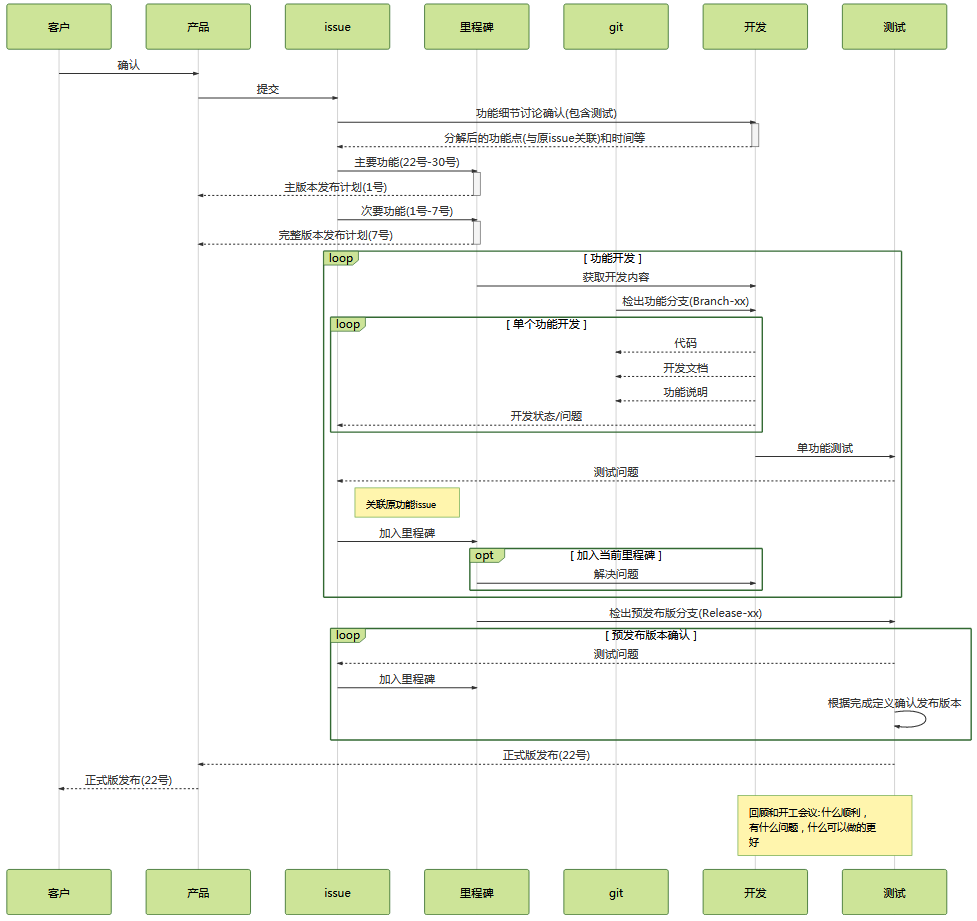
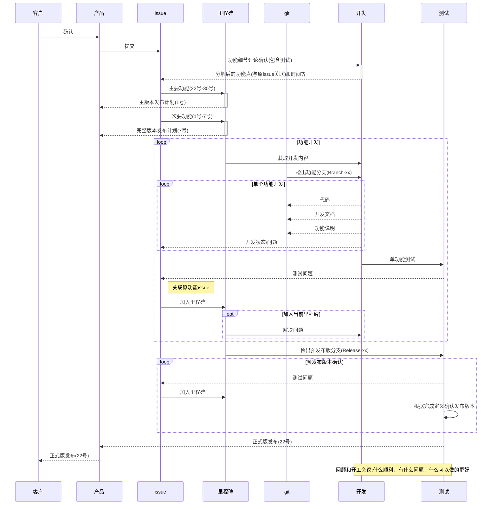

```mermaid
sequenceDiagram
    participant 客户
    participant 产品
    participant issue
    participant 里程碑
    participant git
    participant 开发
    participant 测试
    客户->>产品: 确认
    产品->>issue: 提交
    issue->>+开发: 功能细节讨论确认(包含测试)
    开发-->>-issue: 分解后的功能点(与原issue关联)和时间等
    issue->>+里程碑: 主要功能(22号-30号)
    里程碑-->>-产品: 主版本发布计划(1号)
    issue->>+里程碑: 次要功能(1号-7号)
    里程碑-->>-产品: 完整版本发布计划(7号)
    loop 功能开发
        里程碑->>开发: 获取开发内容
        git->>开发: 检出功能分支(Branch-xx)
        loop 单个功能开发
            开发-->>git: 代码
            开发-->>git: 开发文档
            开发-->>git: 功能说明
            开发-->>issue: 开发状态/问题
        end
        开发->>测试: 单功能测试
        测试-->>issue: 测试问题
        note right of issue: 关联原功能issue
        issue->>里程碑: 加入里程碑
        opt 加入当前里程碑
            里程碑->>开发: 解决问题
        end
    end
    里程碑->>测试: 检出预发布版分支(Release-xx)
    loop 预发布版本确认
        测试-->>issue: 测试问题
        issue->>里程碑: 加入里程碑
        测试->>测试: 根据完成定义确认发布版本
    end
    测试-->>产品: 正式版发布(22号)
    产品-->>客户: 正式版发布(22号)
    note over 开发,测试: 回顾和开工会议:什么顺利，有什么问题，什么可以做的更好
```
