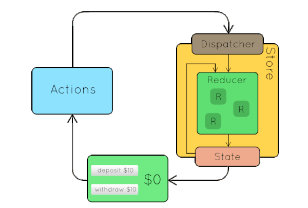
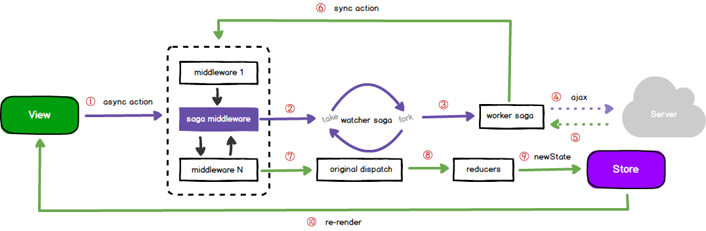
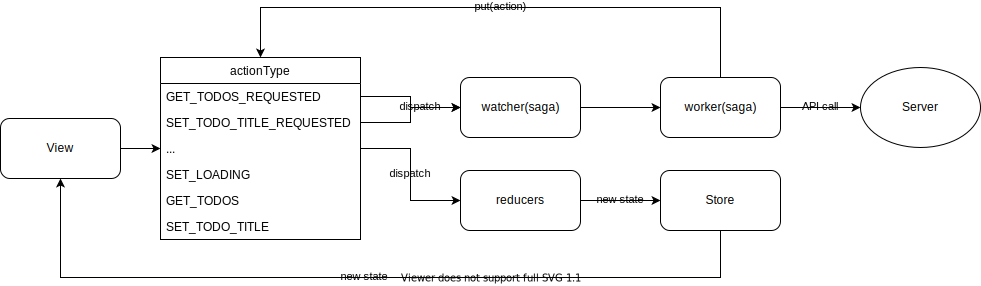
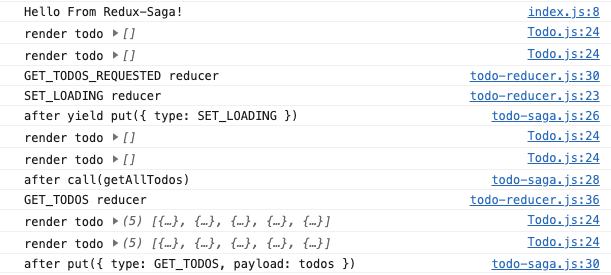
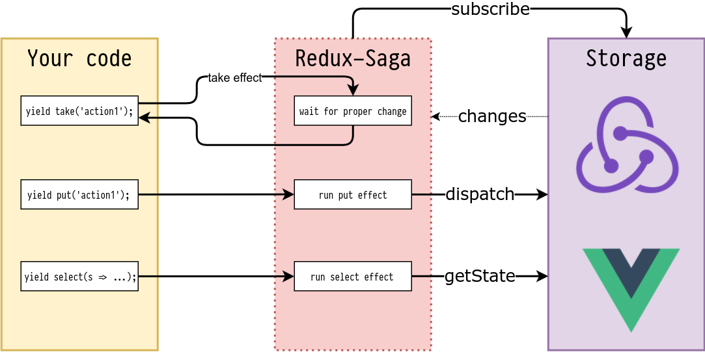
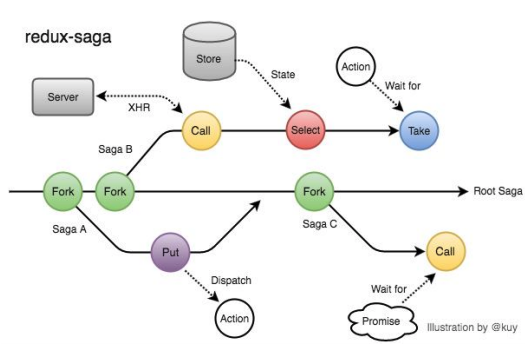
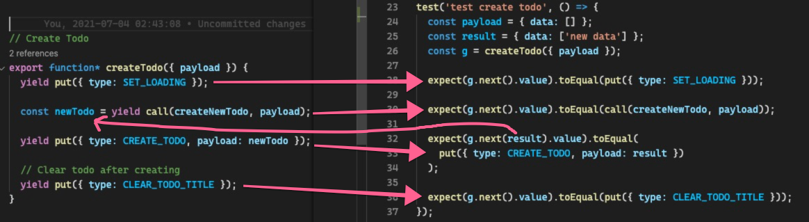

# Redux-saga

---

## Saga 的第一个示例

<style scoped>section {font-size: 18px;}</style>

在使用 redux-saga 的时候首先会看官方的文档，然后看到的第一段代码：

```js
import { delay } from 'redux-saga'
import { put, takeEvery, all } from 'redux-saga/effects'

function* incrementAsync() {
  yield delay(1000)
  yield put({ type: 'INCREMENT' })
}

function* watchIncrementAsync() {
  yield takeEvery('INCREMENT_ASYNC', incrementAsync)
}

// notice how we now only export the rootSaga
// single entry point to start all Sagas at once
export default function* rootSaga() {
  yield all([
    helloSaga(),
    watchIncrementAsync()
  ])
}
```

里面有一些平时开发很少见的东西：

- function*, yield
- delay, put, takeEvery, all

后面会依次介绍

---

## Generator (function* yield)

<style scoped>section {font-size: 20px;}</style>

基本的代码结构是：

```ts
function* gen() {
  yield function genInner() { return 1 };
  yield 2;
  yield 3;
}
const g = gen();

g.next();
// {value: ƒ genInner(), done: false}
g.next();
// {value: 2, done: false}
g.next();
// {value: 3, done: false}
g.next();
// {value: undefined, done: true}
```

简单来说生成器就是

- 用 `function*` 声明生成器函数
- 函数会在 `yield` 处停止然后返回后面的内容。可以把 `yield` 当成 `return` 只是在执行时会在 `yield` 停止而已。
- 返回数据为
    - value: yield 后的内容
    - done: 生成器是否结束

---

### yield

<style scoped>section {font-size: 20px;}</style>

比如下面代码，如果 `yield` 后面的代码是 function 那就会把这个 function 返回回来。

```ts
function* gen() {
  yield function genInner() { return 1 };
  yield 2;
}
const g = gen();

g.next(); // {value: genInner(), done: false}
g.next(); // {value: 2, done: false}
g.next(); // {value: undefined, done: true}
```

还可以给 `next()` 函数传数据进行计算。

```ts
function *gen(){
    yield 10;
    const x = yield 'foo';
    yield x;
}

var gen_obj=gen();
console.log(gen_obj.next());// 执行 yield 10，返回 10
console.log(gen_obj.next());// 执行 yield 'foo'，返回 'foo'
console.log(gen_obj.next(100));// 将 100 赋给上一条 yield 'foo' 的左值，即执行 x=100，返回 100
console.log(gen_obj.next());// 执行完毕，value 为 undefined，done 为 true
```

具体可以参考：<https://developer.mozilla.org/zh-CN/docs/Web/JavaScript/Reference/Global_Objects/Generator>

---

## 数据流

---

### 普通的 redux 数据流



---

### 添加的 middleware 的数据流


无论 saga 还是 thunk 都是通过这个中间件来进行异步通信的。

---

## 基本使用方法

<style scoped>section {font-size: 22px;}</style>

首先是 saga 的一个基本数据流：



这个流程可以分为 4 大部分

- 注册 sagaMiddleware
- 用 saga 监听（异步）action
- 执行 saga 生成器函数
- 数据通过 reducer 写入 store

---

## todo 项目

后面会拿这个 todo 项目来说明基本的功能

<https://github.com/hudaprs/react_state_management_saga>

---

### 注册 sagaMiddleware

首先需要将 `sagaMiddleware` 创建出来并运行起来。其中 `rootSaga` 里面包含了所有需要监听的事件。

```js
import { createStore, applyMiddleware } from 'redux' 
import createSagaMiddleware from 'redux-saga'
import rootSaga from './sagas'
import rootReducer from './reducers'

const sagaMiddleware = createSagaMiddleware()

const store = createStore(
	rootReducer,
	applyMiddleware(sagaMiddleware)
)

// Run redux-saga
sagaMiddleware.run(rootSaga)
```

---

### 用 saga 监听（异步）action

<style scoped>section {font-size: 20px;}</style>

再看看 `rootSaga` 里面的内容:

```js
export default function* rootSaga() {
	console.log("Hello From Redux-Saga!")
	
	yield spawn(todoSaga)
}

export default function* todoSaga() {
  yield takeEvery(GET_TODOS_REQUESTED, getTodos)
  yield takeEvery(SET_TODO_TITLE_REQUESTED, setTodoTitle)
  yield takeLatest(CREATE_TODO_REQUESTED, createTodo)
  yield takeEvery(DELETE_TODO_REQUESTED, deleteTodo)
}
```

`rootSaga` 的主要功能是给对应 `action` 注册需要执行的 `saga` 生成器函数。之后在执行 `dispatch({ type: 'GET_TODOS_REQUESTED' })` 时 `sagaMiddleware` 会直接执行 `action` 对应的函数。

里面有用到三个 saga 的函数：`spawn`, `takeEvery`, `takeLatest`。

- `spawn` 这个是后端的一种关键字，类似于创建新线程。
- `takeEvery`, `takeLatest` 用来给 `sagaMiddleware` 注册函数的，他们之间有些执行方面的差异。
  - `takeEvery` 是每次执行的结果都会返回
  - `takeLatest` 如果前一个任务还没结束，下一个任务就到了的时候，会取消前一个任务。

---

### 执行 saga 生成器函数

saga 函数内就是相关的 side effect 操作。

```js
function* getTodos() {
  yield put({ type: SET_LOADING })
  const todos = yield call(getAllTodos)
  yield put({ type: GET_TODOS, payload: todos })
}
```

里面有两个 saga 的函数 `put`, `call`

- `put` 就类似于 dispatch 用来执行 action 操作。
- `call` 和 js 里面的 call 比较相似，用来执行对应的函数，只不过它是异步的。

---

### todo saga 总览

<style scoped>section {font-size: 18px;}</style>



对于 `dispatch({ type: GET_TODOS_REQUESTED })` 执行的顺序是



1. 进入 `GET_TODOS_REQUESTED` 对应的 `reducer` 如果写了的话
2. 触发 rootSaga 中的 `yield takeEvery(GET_TODOS_REQUESTED, getTodos)` 并执行其中的函数
3. 执行 `getTodos` 第一条 `yield put({ type: SET_LOADING })`
    1. 执行 `SET_LOADING` 对应的 `reducer`
    2. 重新渲染界面
4. 执行 `getTodos` 中的第二行 `const todos = yield call(getAllTodos)`
    1. 因为 yield 所以重新渲染界面
5. 执行 `getTodos` 中的第三行 `yield put({ type: GET_TODOS, payload: todos })`
    1. 执行 `GET_TODOS` 对应的 `reducer`
    2. 重新渲染界面

---

## 主要的 API （put，take，fork等）

---

### put, take, select

<style scoped>section {font-size: 18px;}</style>

对于 take, put, select 这三种 effect 创建器



- put: 相当于调用 dispatch(action)
- take: 阻塞当前 saga，直到收到指定的 action，代码才会往下执行。应该是在某个 action 执行后才能开始执行的意味。
- select: 获取 store 里面的数据，有点和 redux 的 selector 比较像。

---

### call, fork, spawn, join

- call：阻塞当前 saga 执行，直到被调函数返回结果
- fork：不阻塞当前 saga 执行，会立即返回一个 task 对象。它会附加在父级任务上，父级任务关闭它也关闭，而且错误会冒泡到父级任务上。
- spawn：和 fork 比较像，差别在于创建的是完全分离的任务，和父级任务完全独立。父级任务关闭也对它没影响，其他事件也是独立的。
- join：可以用这个等待 fork 出去的子 task 执行结束。

---

### 异常处理

---

#### 一般异常处理

类似于 promise 可以使用 `try...catch...` 来处理异常。

```js
function* saga() {
 try {
   const data = yield call(fetch, '/someEndpoint');
   return data;
 } catch(e) {
   // 日志上报
   logger.error('request error: ', e);
   // 错误提示
   antd.message.error('请求失败');
 }
}
```

---

#### 使用 fork 时的异常处理

<style scoped>section {font-size: 18px;}</style>

在使用 fork 的情况下，error 会向父级抛出，下面代码就会导致整个 app 挂掉。

```js
function* saga1 () { /* ... */ }
function* saga2 () { throw new Error('模拟异常'); }
function* saga3 () { /* ... */ }

function* rootSaga() {
  yield fork(saga1);
  yield fork(saga2);
  yield fork(saga3);
}
// 启动 saga
sagaMiddleware.run(rootSaga);
```

redux-saga 中执行 `sagaMiddleware.run(rootsaga)` 或 `fork(saga)` 都会返回一个 task 对象，嵌套的 task 之间就会存在父子关系。



- `rootSaga` 生成了 rootTask。
- `sagaA`，`sagaB` 和 `sagaC`，在 rootSaga 内部执行，生成的 task，均被认为是 rootTask 的 childTask。

在 **childTask(sagaB)** 异常时，由于 fork

- 在 **父级 task** 收到通知后，会先执行自身的 cancel 操作。
- 再通知其他 **childTask(sagaA, sagaC)** 同样执行 cancel 操作。

---

#### 使用 spawn 解决 saga 分支异常问题

解决这个问题的一个方法是使用 spawn 避免互相影响。

```js
export default function* rootSaga() {
  yield spawn(saga1);
  yield spawn(saga2);
  yield spawn(saga3);
}
```

---

### 失败重试

如果需要对某些 api 进行重试的话，可以如下面代码来写，也可以将 `while (true)` 换成次数

```js
function* rootSaga () {
  const sagas = [ saga1, saga2, saga3 ];

  yield sagas.map(saga =>
    spawn(function* () {
      while (true) {
        try {
          yield call(saga);
        } catch (e) {
          console.log(e);
        }
      }
    })
  );
}
```

---

## saga 的单元测试

对于 saga 的测试其实就是对于 generator 做测试



由于里面每一次 yield 都会返回后面的内容，所以就可以拿这个数据来做检查。

另外由于可以 `next(<return data>)` 将数据给 yield 前的变量。所以可以用这个特性来给异步请求赋值。

---

## 参考文档

https://www.yuque.com/lovesueee/blog/redux-saga

https://zhuanlan.zhihu.com/p/82442831

https://redux-saga-in-chinese.js.org/

https://blog.devgenius.io/reactjs-simple-understanding-redux-with-redux-saga-f635e273e24a

---

谢谢！