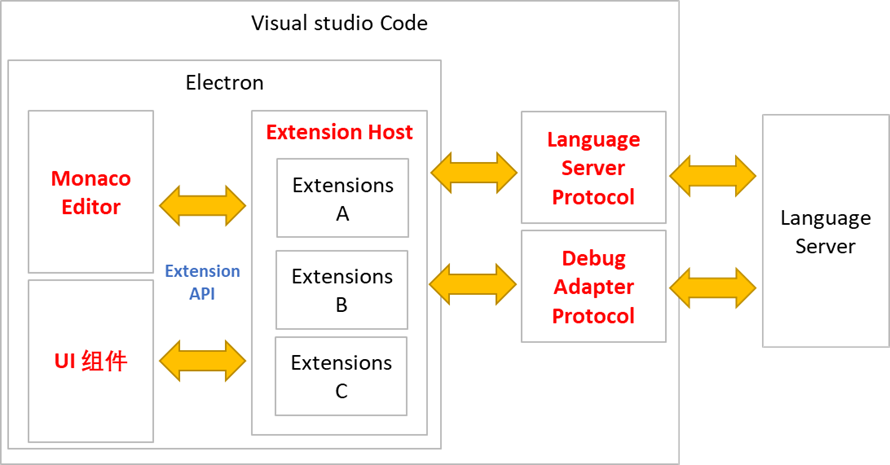

# VSCode 组成结构

VSCode 是基于 Electron 构建的，主要由三部分构成：

- Electron: UI
  - Monaco Editor
  - Extension Host
- Language Server Protocol & Debug Adapter Protocol

VSCode 中的大部分功能都是通过 Extension Host 来实现的。符合 LSP 的插件对应的高亮等语言特性就会反映到 Monaco Editor 上。从源码的 [extensions](https://github.com/microsoft/vscode/tree/master/extensions) 目录中可以看到，VSCode 默认集成了各种语言的插件。

## Monaco Editor

是一个基于网页的编辑器，有符合 LSP 的插件就可以进行高亮、悬停提示，导航到定义、自动补全、格式化等功能。它的代码位于 [https://github.com/Microsoft/monaco-editor](https://github.com/Microsoft/monaco-editor)

## Extension Host

VSCode 的主进程和插件进程是分开管理的，`Extension Host` 就是用来管理插件进程的。

Extension Host 是用来确保插件：

- 不影响启动速度
- 不会减低 UI 响应速度
- 不会改变 UI 样式

因此保证 VSCode 的稳定和快速的密码就在于使用 Extension Host 将主进程和插件进程分开，使插件不会影响到 VSCode 主进程的性能和稳定。

在编写插件的时候 VSCode 可以让插件设置 `Activation Events` 来对插件懒加载。比如只有打开了 Markdown 文件才打开对应的插件。这样可以降低无谓的 CPU 和内存使用。

## Language Server Protocol & Debug Adapter Protocol

这两个协议主要是为了将编辑器和编程语言/调试服务的功能分离开，实现任何语言只要编写对应的语言服务即可。目前各大编辑器都已经支持了这个协议。
