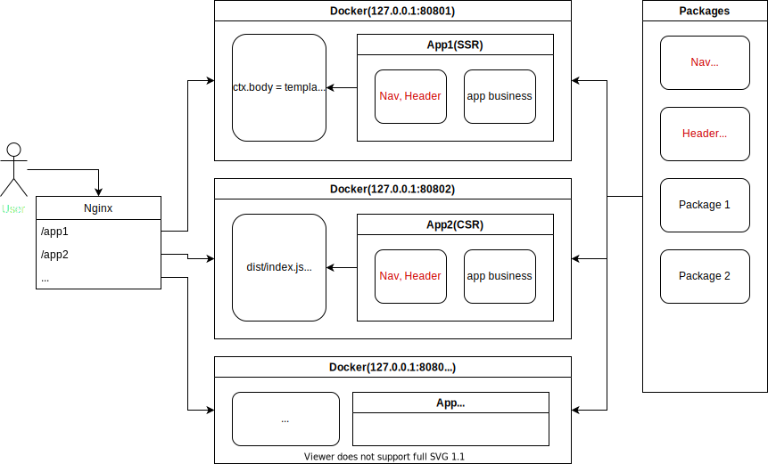
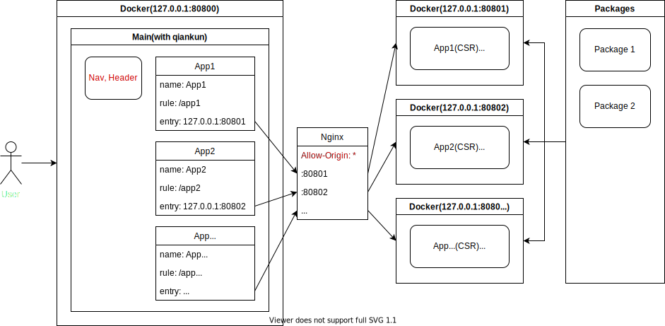

# 微前端

## 单独打包并基于 nginx 反向代理

### 优点

- 各个 app 独立打包和部署；
- 根据需要可以做成服务端渲染或客户端渲染；
- 各个 app 无主次之分，互相之间没有依赖关系；
- 基于 nginx 做主路由，调整路由不需要动任何 app。

### 缺点

- 所有 app 都包含 Nav, Header 这种公共组件，**打包文件比较大**；
- 切换 app(主路由) 的时候会整个页面刷新，影响体验。

## 基于 qiankun（single-spa）

### 优点

- Nav, Header 这种公共组件在基座 app(main app) 内，各个 app 只包含自己的业务部分，**打包文件小**；
- 切换 app(主路由) 的时候页面不会刷新整个页面，比较友好。

### 缺点

- 基座 app(main app) 对其他组件影响比较大，如果出问题，所有 app 都无法使用；
- app 如果没有特别处理，则不能单独运行；
- 如果部署到不同容器中，则可能需要设置跨域。

## Web Component
