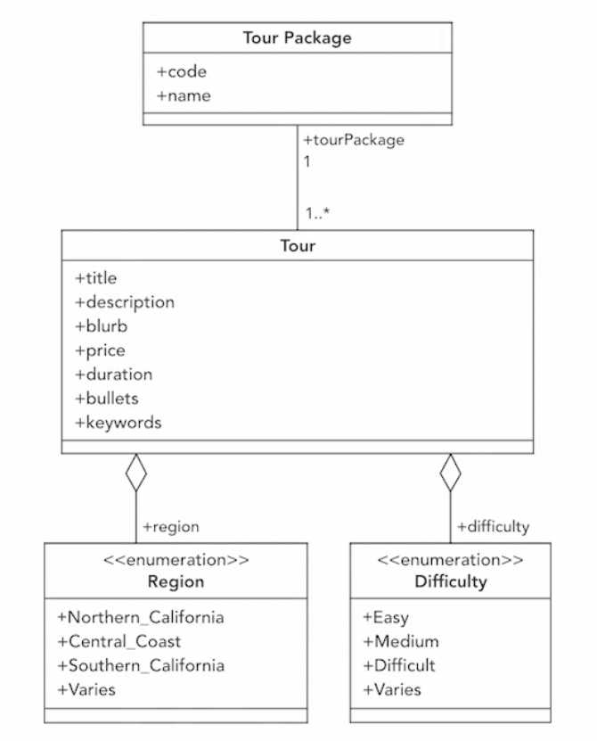

# Spring boot

基于 Linkedin 课程 https://github.com/maryellenteaches/FirstSpringBootMicroservice

## 创建并运行一个 spring boot 项目

1. 创建可以有很多方式，首先可以去 spring boot 官网上创建
2. `mvn install`
    - 下载所有的依赖
    - 对项目打包成一个 jar 文件
3. 运行
    1. `java -jar target/xxx.jar` 运行打包好的文件，会默认在 8080 端口开启服务
    2. `java -Dserver.port=9090 -jar target/xxx.jar`，指定 9090 作为服务端口

## 创建 Spring 数据 JPA(Java Persistence API) 存储库接口

### Domain 模型



### Entities

为给定的领域模型定义数据结构，可以使用类似于 `@Entity`, `@Id`, `@Column` 这些注解来标记对应字段。同时也应该根据需要提供一些基础方法。例如初始化的构造方法、必要的 get set 方法和复写 `toString` 和 `equals`。

https://github.com/maryellenteaches/FirstSpringBootMicroservice/tree/2-2/explorecali/src/main/java/com/example/ec/domain

```java
@Entity
public class Tour {
    @Id
    @GeneratedValue
    private Integer id;

    @Column
    private String title;

    @Column(length = 2000)
    private String description;

    @Column(length = 2000)
    private String blurb;

    @Column
    private Integer price;

    @Column
    private String duration;

    @Column(length = 2000)
    private String bullets;

    @Column
    private String keywords;

    @ManyToOne
    private TourPackage tourPackage;

    @Column
    @Enumerated
    private Difficulty difficulty;

    @Column
    @Enumerated
    private Region region;

    public Tour(String title, String description, String blurb, Integer price, String duration, String bullets,
            String keywords, TourPackage tourPackage, Difficulty difficulty, Region region) {
        this.title = title;
        this.description = description;
        this.blurb = blurb;
        this.price = price;
        this.duration = duration;
        this.bullets = bullets;
        this.keywords = keywords;
        this.tourPackage = tourPackage;
        this.difficulty = difficulty;
        this.region = region;
    }
}

public enum Region {
    Central_Coast("Central Coast"), Southern_California("Southern California"),
    Northern_California("Northern California"), Varies("Varies");

    private String label;

    private Region(String label) {
        this.label = label;
    }

    public static Region findByLabel(String byLabel) {
        for (Region r : Region.values()) {
            if (r.label.equalsIgnoreCase(byLabel))
                return r;
        }
        return null;
    }
}
```

### Spring data JPA repository

首先要创建领域模型对应的接口，也就是继承 `CrudRepository<T, Id>`。其中 `T` 就是对应的领域模型，`Id` 则是该领域模型 id 的类型。

在继承 `CrudRepository` 后，对应的领域模型就自动有了 create, read, update, delete 的方法。

```java
public interface TourRepository extends CrudRepository<Tour, Integer> {
    // 在继承后会默认情况下自动有以下方法，这些方法的实现是由 spring 处理的，所以不用自己手写
    // create and update
    save(Tour s);
    Iterable<Tour> saveAll(Iterable<Tour> iterable);

    // read
    Optional<Tour> findById(Integer integer);
    boolean existsById(Integer integer);
    Iterable<Tour> findAll();
    Iterable<Tour> findAllById(Iterable<Integer> iterable);
    long count();

    // delete
    void deleteById(Integer integer);
    void delete(Tour tour);
    void deleteAll(Iterable<Tour> iterable);
    void deleteAll();
}
public interface TourPackageRepository extends CrudRepository<TourPackage, String> {
}
```

### Service

Service 就是提供服务的部分，因此在 service 目录下，根据业务需要提供对应的类来实现业务功能。

https://github.com/maryellenteaches/FirstSpringBootMicroservice/tree/2-4-end/explorecali/src/main/java/com/example/ec/service

```java
@Service
public class TourService {
    private TourRepository tourRepository;
    private TourPackageRepository tourPackageRepository;

    @Autowired
    public TourService(TourRepository tourRepository, TourPackageRepository tourPackageRepository) {
        this.tourRepository = tourRepository;
        this.tourPackageRepository = tourPackageRepository;
    }

    public Tour createTour(String title, String description, String blurb, Integer price,
                           String duration, String bullets,
                           String keywords, String tourPackageName, Difficulty difficulty, Region region ) {
        TourPackage tourPackage = tourPackageRepository.findByName(tourPackageName).orElseThrow(()-> new RuntimeException("Tour package does not found"));

        return tourRepository.save(new Tour(title, description,blurb, price, duration, bullets, keywords, tourPackage, difficulty, region)) ;
    }

    public long total() {
        return tourRepository.count();
    }
}
```

### Spring data query methods

如果希望给 repository 添加一些查询的方法，可以直接在 repository 中添加对应名称的接口。然后 spring 会自动生成对应语意的查询方法。

https://github.com/maryellenteaches/FirstSpringBootMicroservice/blob/2-6-end/explorecali/src/main/java/com/example/ec/repo/TourPackageRepository.java

```java
public interface TourPackageRepository extends CrudRepository<TourPackage, String> {
    Optional<TourPackage> findByName(String name);
}
```

如果希望让 spring 自动生成查询方法，则需要符合以下条件

1. 返回类型
2. 以 findBy 开头
3. findBy 后面接着的是 Entity 的属性名（camelCase）
4. 参数的数据类型和 entity 的数据类型相同

简单的写法如下

```java
List<Tour> findByTourPackageCode(String code);
Optional<Tour> findByTitle(String title);
Collection<Tour> findByDifficulty(Difficulty difficulty);
```

复杂的情况下，还可以在中间加 As, And, Or, In, LessThan, Contains, Like

```java
List<Tour> findByTourPackageCodeAndRegion(String code, Region region);
List<Tour> findByRegionIn(List<Region> regions);
List<Tour> findByKeywordsContains(String keyword);
List<Tour> findByTourPackageCodeAndBulletsLike(String code, String searchString);
List<Tour> findByTourPackageCodeAndDifficultyAndRegionAndPriceLessThan(String code, Difficulty difficulty, Region region, Integer maxPrice);
```

另外也可以通过写 SQL 来处理更为复杂的情况。

```java
@Query("Select t from Tour t where t.tourPackage.code = ?1 " +
        " and t.difficulty = ?2 and t.region = ?3 and t.price <= ?4")
List<Tour> lookupTour(String code, Difficulty difficulty, Region region, Integer maxPrice);
// same as
List<Tour> findByTourPackageCodeAndDifficultyAndRegionAndPriceLessThan(String code, Difficulty difficulty, Region region, Integer maxPrice);
```

## RESTful APIs with Spring Data REST

### 通过 Spring DATA REST 创建 API

由于添加了 `spring-boot-starter-data-rest` 作为依赖，所以我们不需要写任何代码。它会在应用开始的时候扫描所有 class 文件，找到所有的 spring data repositories，并以实体（Entity）名作为 api 名。

```java
// Create: HTTP POST /tourPackages {<request body>}
TourPackage tp = new TourPackage();
// ...添加 tp 内容...
TourPackageRepository.save(TourPackage tourPackage);

// Read: HTTP GET /tourPackages
TourPackageRepository.findAll();

// Read: HTTP GET /tourPackages/<code>
TourPackageRepository.findById(String code);

// Update: PUT or PATCH /tourPackages/<code> {<request body>}
TourPackage tp = TourPackageRepository.findById(String code);
// ...修改 tp 内容...
TourPackageRepository.save(tp);

// Delete: DELETE /tourPackages/<code>
TourPackageRepository.deleteById(String code);
```

### /search

使用 spring data rest 也会暴露一个 /search 的接口，repository 中所有自定义的接口都会在这个下面。比如之前在 `tourPackageRepository` 中有添加一个 `Optional<TourPackage> findByName(String name);` 则调用 `/search` 后会返回这个 findByName 接口，并可以使用。

```java
// 如果是以前版本的 spring data rest 则需要像下面一样添加 @Param("code") 注解
List<Tour> findByTourPackageCode(@Param("code")String code);
```

### 翻页和排序

- size: 每页条数
- page: 第几页，从 0 开始
- sort: 包括排序列和方向两个参数用逗号分隔 `sort=title,asc`。默认按照 id 排序，排序的方向，可以填 asc 或 desc

在原有的基础上将继承 `CrudRepository` 改为 `PagingAndSortingRepository` 同时返回值类型改为 `Page` 并且添加 `Pageable` 参数。

```java
public interface TourRepository extends PagingAndSortingRepository<Tour, Integer> {
    Page<Tour> findByTourPackageCode(@Param("code")String code, Pageable pageable);
}
```

### 控制暴露的接口

正常情况下会暴露所有的接口，当然可能并不需要暴露那么多给。这样的情况下需要给对应 repository 方法加 `@Override` 和 `@RestResource(exported = false)` 注解。

```java
public interface TourRepository extends PagingAndSortingRepository<Tour, Integer> {
    Page<Tour> findByTourPackageCode(@Param("code")String code, Pageable pageable);

    @Override
    @RestResource(exported = false)
    <S extends Tour> S save(S s);

    @Override
    @RestResource(exported = false)
    <S extends Tour> Iterable<S> saveAll(Iterable<S> iterable);

    @Override
    @RestResource(exported = false)
    void deleteById(Integer integer);

    @Override
    @RestResource(exported = false)
    void delete(Tour tour);
}
```

### 修改暴露的接口节点

通过添加 `@RepositoryRestResource` 即可将默认的 `tourPackages` 改为 `packages`。

```java
@RepositoryRestResource(collectionResourceRel = "packages", path = "packages")
public interface TourPackageRepository extends CrudRepository<TourPackage, String> {
}
```

## 使用 Spring MVC

### 比较 Spring Data REST 和 MVC

- Spring MVC
    - Client Request -> My RestController Class -> My Service
- Spring Data Rest
    - Client Request -> Spring Data REST -> My Spring Data Repository

### 简单的 RestController

```java
@RestController
@RequestMapping(path = "/examples")
public class ExampleController {
    @PostMapping
    @ResponseStatus(HttpStatus.CREATED) // 正常情况下会返回 200
    public Example create(@RequestBody Example example)

    @GetMapping
    public List<Example> getAllExamples()
    @GetMapping(path = "/{id}")
    public Example getOneExample(@PathVariable(value = "id") int id)

    @PutMapping(path = "/{id}") // or @PatchMapping(path = "/{id}")
    public Example updateAll(@PathVariable(value = "id") int id, @RequestBody Example example)
}
```

### DTO(Data Transfer Object)

很多时候，客户发送的 request 结构不一定和实体中的数据结构相同，可能需要做一些转换、补足数据或校验等操作。这时就需要 DTO 类来进行对应的处理。

https://github.com/maryellenteaches/FirstSpringBootMicroservice/blob/4-3-end/explorecali/src/main/java/com/example/ec/web/RatingDto.java

```java
public class RatingDto {
    @Min(0)
    @Max(5)
    private Integer score;

    @Size(max = 255)
    private String comment;

    @NotNull
    private Integer customerId;

    public RatingDto(TourRating tourRating) {
        this(tourRating.getScore(), tourRating.getComment(), tourRating.getPk().getCustomerId());
    }

    private RatingDto(Integer score, String comment, Integer customerId) {
        this.score = score;
        this.comment = comment;
        this.customerId = customerId;
    }
}
```

### RestController POST

https://github.com/maryellenteaches/FirstSpringBootMicroservice/tree/4-3-end/explorecali/src/main/java/com/example/ec/web

```java
@RestController
@RequestMapping(path = "/tours/{tourId}/ratings")
public class TourRatingController {
    private TourRatingRepository tourRatingRepository;
    private TourRepository tourRepository;

    @Autowired
    public TourRatingController(TourRatingRepository tourRatingRepository, TourRepository tourRepository) {
        this.tourRatingRepository = tourRatingRepository;
        this.tourRepository = tourRepository;
    }

    protected TourRatingController() {
    }

    @PostMapping
    @ResponseStatus(HttpStatus.CREATED)
    public void createTourRating(@PathVariable(value = "tourId") int tourId, @RequestBody @Validated RatingDto ratingDto) {
        Tour tour = verifyTour(tourId);
        tourRatingRepository.save(new TourRating( new TourRatingPk(tour, ratingDto.getCustomerId()),
                ratingDto.getScore(), ratingDto.getComment()));
    }

    // 检查 tourId 是否存在的方法
    private Tour verifyTour(int tourId) throws NoSuchElementException {
        return tourRepository.findById(tourId).orElseThrow(() ->
            new NoSuchElementException("Tour does not exist " + tourId));
        }

    // 处理当前 class 抛出的对应错误 error
    @ResponseStatus(HttpStatus.NOT_FOUND)
    @ExceptionHandler(NoSuchElementException.class)
    public String return400(NoSuchElementException ex) {
        return ex.getMessage();
    }
}
```

## 使用 MongoDB

| Spring Data JPA                          | Spring Data Mongo                                     |
| ---------------------------------------- | ----------------------------------------------------- |
| @Entity                                  | @Document                                             |
| @Id(String\|Number)<br />@GeneratedValue | @Id(String)<br />Automatically generate               |
| @Column                                  | N/A                                                   |
| @N/A                                     | @Indexed - to increase search performance             |
| @ManyToOn                                | N/A                                                   |
| @OneToMany                               | N/A                                                   |
| @ManyToMany                              | N/A                                                   |
| @OneToOne                                | N/A                                                   |
| N/A                                      | @DBRef - Refers to another Document within a Document |

如果有需求虽然有一些固定的字段，比如 id、name、code 等，但其他具体的信息却是动态的。这个时候就可以使用 MongoDB。

### MongoDB documents

https://github.com/maryellenteaches/FirstSpringBootMicroservice/tree/5-end/explorecali/src/main/java/com/example/ec

- @Entity 换成 @Document
- @Column 都不需要了
- id： 从 Integer 换成 String
- 被检索数据：title、tourPackageCode 这些需要检索的内容加 @Index 来加快搜索
- 联合表数据：多个 Entity 要合并成一个，所有其他的具体信息则要放入一个 `Map<String, String> details` 中 
- 关联数据：对于 rating 这种的与 tour 关联的数据，则使用 tourId 与 tour 的数据关联

### Repository

主体变化不大，主要是 id 从 Integer 换成，如果写的是 Query 则需要从 SQL 换成 MongoDB 的语法。

### Service

返回的数据要修改一下，因为具体各个字段的信息被 `Map<String, String> details` 代替了。

### microservice APIs

和 service 差不多，要将之前单独的各个字段换成 `Map<String, String> details`
