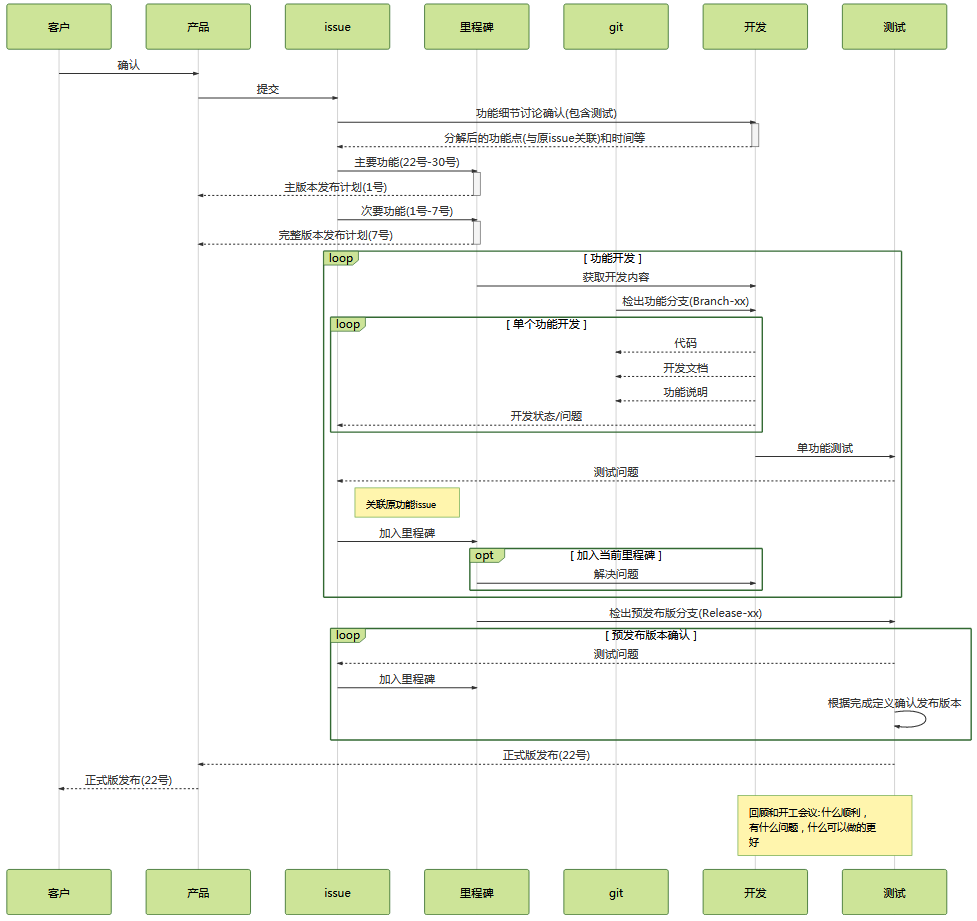

- [软件开发工作指南](#)
    - [工作流程](#)
    - [工作方法](#)
    - [代码规范](#)
        - [CSharp](#csharp)
        - [Java](#java)
    - [工作完成定义](#)
    - [项目状况确认](#)

# 软件开发工作指南

## 工作流程

参参照了 gitlab 的工作流程

## 工作方法

- 时间分配: 月度版本设计讨论1-2周，开发2-3周
- 工作内容: 只开发列入月度版本的功能，没有列入月度版本的功能不能进行开发
- 工作方法: 凡事开始于issue，各类讨论和结论也要更新到issue上，所有事情以issue内容为准，没有记录的就是没有发生的!
- 会议要求:
    - 开会准备: 提前说明议题、必要性，形式不限，issue、电子邮件都行，准备会议议程。
    - 会议记录: 现场记录到issue上，结束前宣读结论。避免差错和记录没有达成共识的事情，绝对禁止会后记录，开会没达成共识等于没开会。
    - 会后跟踪: 按照issue进行跟踪
- 职责权限:
    - 产品负责人对产品和版本发布负责
        - 功能issue建立
        - 功能是否完成和满足客户期望
        - 每个版本完成时的生成和发布
    - 测试对工作质量负责
        - 代码符合开发规范
        - 功能符合设计
        - 文档符合文档规范
        - 开发过程issue内容描述确认
        - 各个开发issue的完成确认
        - 主分支的的“合并请求”审核
    - 开发对开发过程负责
        - 功能issue设计分解和分解后的工作issue定义，并关联到原功能issue
        - 开发实施
        - 开发过程描述
        - 功能使用说明
        - 全体开发对全部工作issue的工期估算负责
        - 在推送代码后，确认持续集成服务器中的构建和单元测试结果，若失败必须马上解决
    - 项目技术负责人对“合并请求”的代码评审结果负责
    - 全员对每个发行的最终版本、里程碑各个关键节点负责

## 代码规范

按照代码规范来编写代码，至少符合其中大部分要求。

### CSharp

[代码规范](http://csharpcodingguidelines.com/)

[代码规范速查表(中文)](../Reference/CSharpCodingGuidelinesCheatsheet_cn.htm)

[代码规范速查表(英文)](../Reference/CSharpCodingGuidelinesCheatsheet_en.htm)

> 安装resharper，并导入配置文件。resharper提示的问题都要修改，提示的warning要解决。

### Java

[谷歌代码规范](https://google.github.io/styleguide/javaguide.html)

[阿里巴巴Java开发手册](https://github.com/alibaba/p3c)

## 工作完成定义

1. 应该有注释的地方都写了注释
1. 可工作的和干净的代码
1. 通过单元和系统测试
1. 文档已经放到doc目录中
1. 程序中有变更日志入口，内容写入对应记录的地方(建议用脚本根据git提交信息生成)
1. 评审过和所有担忧的问题都已经解决
1. 代码被“负责人”合并到主线

如果代码中增加了依赖或其他影响前一个版本使用的变更，要写相关信息到合并请求中。

## 项目状况确认

测试每周一发布质量报告，包含

1. 本月里程碑进展:issue完成数量/总数
1. 各个项目里程碑版本中存在的问题
1. 代码静态审查结果
