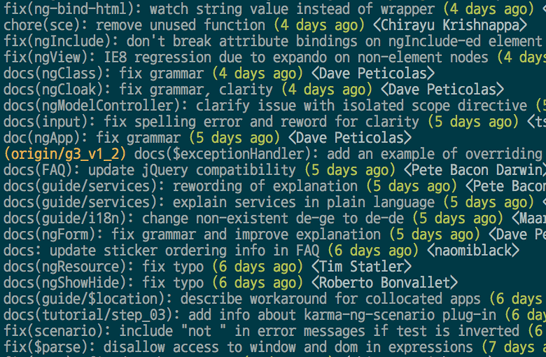

本文参考了阮一峰的《Commit message 和 Change log 编写指南》(图片都是里面的)

一般来讲，commit信息可以随便写什么都行，但是清晰明了还是最好的。


社区中有很多commit信息编写方法，本文介绍的是[Angular规范](https://github.com/angular/angular/blob/master/CONTRIBUTING.md#commit)

# Commit信息的作用
格式化的Commit message，有几个好处。

##　提供更多的历史信息，方便快速浏览

比如，下面的命令显示上次发布后的变动，每个commit占据一行。你只看行首，就知道某次 commit 的目的。

    $ git log <last tag> HEAD --pretty=format:%s



## 可以过滤某些commit（比如文档改动），便于快速查找信息

比如，下面的命令仅仅显示本次发布新增加的功能。

    $ git log <last release> HEAD --grep feature

## 可以直接从commit生成Change log

Change Log也就是变更记录，发布新版本时，用来说明与上一个版本差异的文档


# Commit信息的格式(angular规范)

每次提交，Commit信息都包括三个部分：Header，Body 和 Footer。

    <type>(<scope>): <subject>
    // 空一行
    <body>
    // 空一行
    <footer>

其中，Header 是必需的，Body 和 Footer 可以省略。

不管是哪一个部分，任何一行都不得超过72个字符（或100个字符）。这是为了避免自动换行影响美观。

## Header

Header部分只有一行，包括三个字段：type(必需)、scope(可选)和subject(必需)。

### Type

type用于说明 commit 的类别，只允许使用下面8个标识

* **feat**: 新功能(feature)
* **fix**: 修补bug
* **docs**: 文档(Documentation)
* **style**: 格式(不影响代码运行的变动)(例如:空格、调整格式、加分号或其他)
* **refactor**: 重构(即不是新增功能，也不是修改bug的代码变动)
* **perf**: 提升性能的变更
* **test**: 增加测试
* **chore**: 构建过程或辅助工具的变动，例如文档生成工具的变更

如果type为feat和fix，则该 commit 将肯定出现在 Change log 之中，pref也可以考虑放入Change log中。其他情况（docs、chore、style、refactor、test）由你决定，要不要放入 Change log，建议是不要。

### Scope

scope用于说明 commit 影响的范围，比如数据层、控制层、视图层等等，也可以用功能名称，视项目不同而不同。

### Subject

subject是 commit 目的的简短描述，不超过50个字符。

- 以动词开头，使用祈使句，第一人称现在时，比如change(修改)，而不是changed(修改了)或changes(改了一些xxx)
- 第一个字母小写
- 结尾不加句号(.)

## Body

Body 部分是对本次 commit 的详细描述，可以分成多行。对于body有以下两点要求

- 和subject中要求相同，以动词开头，使用祈使句，第一人称现在时，比如change(修改)，而不是changed(修改了)或changes(改了一些xxx)
- 应该说明代码变动的动机，以及与以前行为的对比。 

## Footer

Footer 部分只用于两种情况

### 不兼容变动

如果当前代码与上一个版本不兼容，则 Footer 部分以BREAKING CHANGE开头，后面是对变动的描述、以及变动理由和迁移方法。

```git
BREAKING CHANGE: isolate scope bindings definition has changed.

    To migrate the code follow the example below:

    Before:

    scope: {
      myAttr: 'attribute',
    }

    After:

    scope: {
      myAttr: '@',
    }

    The removed `inject` wasn't generaly useful for directives so there should be no code using it.
```

### 关闭 Issue

如果当前 commit 针对某个issue，那么可以在 Footer 部分关闭这个 issue 。

    Closes #234

也可以一次关闭多个 issue 。

    Closes #123, #245, #992

## Revert

还有一种特殊情况，如果当前 commit 用于撤销以前的 commit，则必须以revert:开头，后面跟着被撤销 Commit 的 Header。

```git
    revert: feat(pencil): add 'graphiteWidth' option

    This reverts commit 667ecc1654a317a13331b17617d973392f415f02.
```

Body部分的格式是固定的，必须写成`This reverts commit <hash>.`，其中的hash是被撤销 commit 的 SHA 标识符。

如果当前 commit 与被撤销的 commit，在同一个发布(release)里面，那么它们都不会出现在 Change log 里面。如果两者在不同的发布，那么当前 commit，会出现在 Change log 的Reverts小标题下面。

# commit规范检查和生成change log工具

## Commitizen

这个是用来检查commit信息规范性的，不过要用npm，用法自己查吧。

## conventional-changelog

这个是用来根据commit信息生成change log的工具，也要用npm，用法自己查吧。