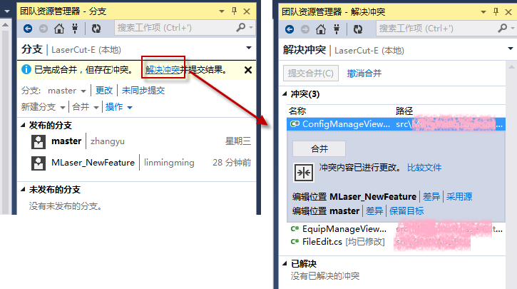

## 在本地将修改内容(LaserCut-MLaser)创建分支
最好是在改的时候就创建好分支，推送的时候两个项目各推送一份。

> 

## 修改完成后推送分支到目标(LaserCut-E)项目远程代码库 
> 

##  在目标库上创建合并请求
> 

##  对比文件并正式创建合并请求
> 

##  产生冲突和解决方法
> 

##  目标项目从远程拉取将要合并的分支
> 

##  切换到master分支并将新分支合并过来
> 

## 选择冲突解决
> 

## 冲突修改
> 

## 推送已解决的代码到远端
> 

## 解决冲突后的合并请求
> 

## 合并分支后的提交图
> 