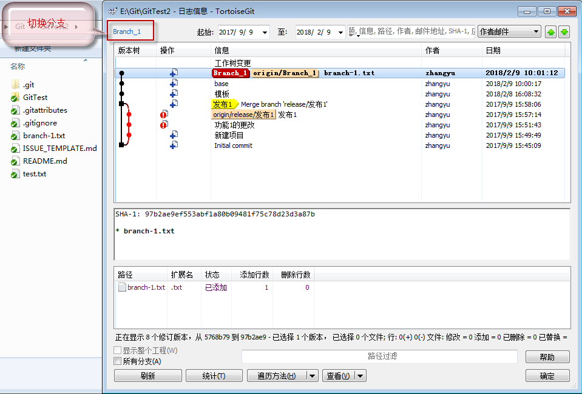
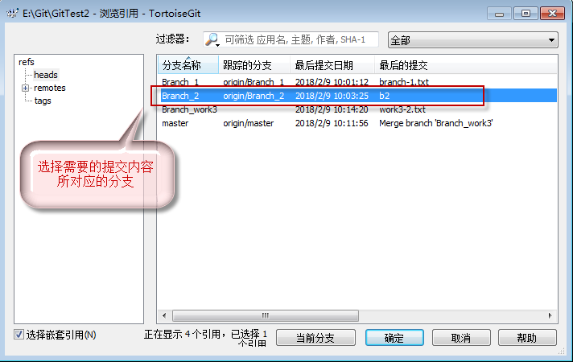
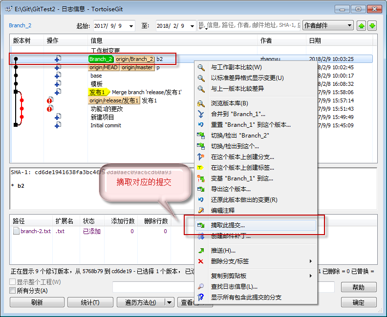
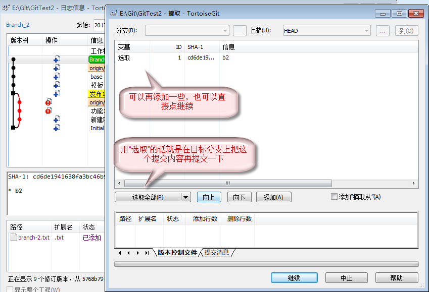

# 从其他分支合并特定的commit

## 命令行的方法
从其他分支合并特定的commit的方法是使用了git的cherry-pick命令，但是这个命令只能对单个commit进行摘取，需要摘取多个的话，要使用rebase命令。

```git
git checkout branch-1  # 切换到branch-1
git cherry-pick cd6de19  # 将cd6de19拿出来放到branch-1里面
```

## TortoiseGit的使用方法

### 切换到目标分支并进入目标分支的log列表

进入log后，点左上角的分支连接，进入分支列表。



### 选择需要的提交内容所对应的分支

从分支列表中选取目标commit所对应的分支



### 摘取对应提交

在目标commit上点右键，并选择摘取命令



### 确认提交内容

如果需要添加多个commit的话，可以再点添加来添加更多的提交内容，TortoiseGit会自动分多次添加。



### 查看摘取后的log

从log上来看，摘取的commit只是把内容摘取过来了，没有以前分支的信息，如果需要的话，可以选取前一步的“添加摘取从...”。

